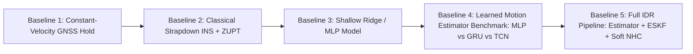

# BetterMaps Intelligent Dead Reckoning (IDR) Model Specification

**Project:** BetterMaps — Intelligent Dead Reckoning for Seamless Navigation  
**Initiative:** Smart India Hackathon (SIH) — Edge Vehicle Navigation under GNSS-Denied Environments  
**Document Type:** Technical Model & Training Specification  
**Version:** 1.1.0 (Post-Red-Team Scientific Revision)  
**Date:** September 4, 2026  
**Author:** Antigravity Autonomous Research Agent  
**Companion Documents:** [`docs/IDR_RESEARCH_DECISIONS.md`](file:///c:/Users/rkadh/OneDrive/Documents/GitHub/bettermaps/docs/IDR_RESEARCH_DECISIONS.md), [`docs/IO-VNBD_DATA_AUDIT.md`](file:///c:/Users/rkadh/OneDrive/Documents/GitHub/bettermaps/docs/IO-VNBD_DATA_AUDIT.md)

---

## Document Conventions & Research Integrity

In accordance with strict research integrity requirements, all technical statements, parameters, and design decisions in this document are explicitly classified using one of the following tags:

- **`FACT:`** Directly observed, measured, and verified from dataset files, source code, hardware experiments, or peer-reviewed documentation.
- **`INFERENCE:`** Analytically or statistically derived from empirical data analysis.
- **`RECOMMENDATION:`** Engineered design choice, architectural decision, or hyperparameter selection justified by evidence.
- **`NOT YET DETERMINED:`** Unresolved technical detail or ongoing empirical question requiring future experiments.

---

## 1. Final System Architecture

### 1.1 Locked Conceptual Dataflow

`RECOMMENDATION:` The end-to-end positioning system follows a modular, hybrid architecture separating deterministic physics, learned motion estimation, and Bayesian state filtering. The machine learning model operates strictly as a local vehicle-motion estimator, not a monolithic navigation black box.

```text
========================================================================================================
                                     NORMAL OPERATION (GNSS ACTIVE)
========================================================================================================
Raw Smartphone Sensors (Accel, Gyro, Mag, Pressure) + Android Fused Location (GNSS)
        │
        ├──► GNSS Stream Gate (Software Toggle / Outage Simulator)
        │           │
        │           ▼
        │    GNSS Measurements (Position, Speed, Bearing, Accuracy)
        │           │
        │           ├──► Orientation / Mounting Auto-Calibration (Aligns phone body to vehicle body)
        │           │
        │           ▼
        │    Extended Kalman Filter / Error-State Kalman Filter (ESKF)
        │           │
        │           ▼
        │    PositionEstimate (High-confidence anchored state) ──► NavigationManager ──► Map UI
        │
        └──► Dual-Position Data Recorder (Persists reference_gnss.csv + raw sensor streams)


========================================================================================================
                                     OUTAGE OPERATION (GNSS DENIED)
========================================================================================================
Raw Smartphone IMU (~400 Hz Native Hardware Stream: Accel, Gyro)
        │
        ▼
[Stage 1: Deterministic Preprocessing]
        - Monotonic nanosecond timestamp ordering & deduplication
        - Anti-aliasing cascaded low-pass filtering (Butterworth / FIR, cutoff 12–15 Hz)
        - Resampling to uniform model input grid (10 Hz baseline or 50 Hz resampled)
        - 6-DOF attitude tracking (complementary / EKF) & gravity vector isolation
        - Coordinate frame transformation (Phone Frame -> Vehicle Body Frame)
        - Static bias compensation & Zero-Velocity Update (ZUPT) detection
        │
        ▼
Preprocessed IMU Tensor Window [T, C] (e.g., 2.0 seconds causal history)
        │
        ▼
[Stage 2: Tiny Learned Vehicle-Motion Estimator (ML Model)]
        - On-device CPU inference (TFLite / ONNX Runtime INT8)
        - Latency budget < 15 ms, parameter count < 100k
        - Predicts vehicle forward velocity v_f and vehicle yaw rate ω_z
        - Predicts heteroscedastic uncertainty (σ_v, σ_ω)
        │
        ▼
Local Motion Estimates [v_f(t), ω_z(t)] + Covariances [σ_v^2, σ_ω^2] (10 Hz Cadence)
        │
        ▼
[Stage 3: Physics-Based State Estimator (ESKF / Kinematic Bicycle Model)]
        - Propagates nominal position, velocity, and heading state vectors
        - Fuses ML velocity/yaw observations using learned dynamic covariances
        │
        ▼
[Stage 4: Non-Holonomic Constraints (NHC) — Soft Probabilistic Update]
        - Lateral velocity pseudo-measurement: v_lateral ≈ 0 with dynamic variance R_NHC,lat
        - Vertical velocity pseudo-measurement: v_vertical ≈ 0 with dynamic variance R_NHC,vert
        │
        ▼
[Stage 5: Road Network & Route Constraints (Map Matching)]
        - Project unconstrained estimate onto topological road graph / active route polyline
        - Heading clamping to road segment direction
        - Event-driven / low-cadence execution (2 Hz to 5 Hz)
        │
        ▼
PositionEstimate (Dead-Reckoning Navigation Output @ 10 Hz)
        │
        ▼
NavigationManager ──► React Native HUD & Google Maps UI
```

### 1.2 Strict Invariants (What the ML Model Must NOT Do)

`RECOMMENDATION:` To prevent hallucination, catastrophic drift, and ungeneralizable shortcuts, the following functional constraints are locked:

1. **The ML model MUST NOT directly predict Latitude and Longitude.** Latitude and longitude are global coordinates; an IMU only measures local reference-frame specific force and angular rate. Global coordinates must be obtained solely by dead-reckoning integration inside the physics-based state estimator.
2. **The ML model MUST NOT perform map matching.** Map topology, turn restrictions, and road geometries must remain external constraints applied by the navigation engine.
3. **The ML model MUST NOT consume road-condition or weather metadata.** Road condition flags (wet, gravel, bumps) are never known a priori on a phone entering a tunnel and must not be model inputs.
4. **The ML model MUST NOT require GNSS at inference time.** The model must execute completely autonomously using only IMU inputs when GNSS is completely blocked.

---

## 2. Model Input Specification

### 2.1 Sensor Set Selection (Comparison of Candidates)

We evaluated three input configurations against our deployment constraints:

`RECOMMENDATION:` **Model A (Accelerometer + Gyroscope) is the locked primary input configuration.**

| Configuration             | Sensor Modalities                               | Pros                                                                                                    | Cons / Audit Evidence                                                                                                                                                                  | Decision                                                             |
| :------------------------ | :---------------------------------------------- | :------------------------------------------------------------------------------------------------------ | :------------------------------------------------------------------------------------------------------------------------------------------------------------------------------------- | :------------------------------------------------------------------- |
| **Model A (Recommended)** | 3-Axis Accel + 3-Axis Gyro (6 channels)         | Universal on all phones; immune to electromagnetic interference; lowest compute; deterministic physics. | Cannot observe absolute magnetic North; heading must be tracked via rate integration.                                                                                                  | **LOCKED PRIMARY**                                                   |
| **Model B**               | Accel + Gyro + 3-Axis Magnetometer (9 channels) | Observes absolute magnetic heading in open fields.                                                      | `FACT:` Audit of stationary run `Vw01` showed cabin electromagnetic steps of $3\ \mu\text{T}$ when vehicle accessories turn on. Steel chassis causes severe soft/hard iron distortion. | **REJECTED FOR RAW ML** (Retained only as auxiliary low-rate filter) |
| **Model C**               | Accel + Gyro + OS Orientation (9–10 channels)   | Provides pre-computed roll/pitch/yaw.                                                                   | `INFERENCE:` Euler angles suffer from gimbal lock and discontinuous wraparound ($-\pi \to +\pi$). Android OS orientation filters vary unpredictably across OEMs.                       | **REJECTED AS DIRECT ML INPUT**                                      |

### 2.2 Input Classification: Raw vs Deterministically Derived vs Optional

#### A. Raw Hardware Sensor Streams (Ingested at Native Device Rate)

- `Sensor.TYPE_ACCELEROMETER` ($\text{m/s}^2$): Tri-axial specific force in device coordinates ($a_{x,d}, a_{y,d}, a_{z,d}$).
- `Sensor.TYPE_GYROSCOPE` ($\text{rad/s}$): Tri-axial angular velocity in device coordinates ($\omega_{x,d}, \omega_{y,d}, \omega_{z,d}$).

#### B. Deterministically Derived Preprocessed Features (Fed to Neural Network)

`RECOMMENDATION:` The neural network input tensor consists of **6 canonical channels**:

1. $a_{\text{long}}$ ($\text{m/s}^2$): Linear acceleration along the vehicle longitudinal axis (forward positive, braking negative).
2. $a_{\text{lat}}$ ($\text{m/s}^2$): Linear acceleration along the vehicle lateral axis (centripetal acceleration during cornering).
3. $a_{\text{vert}}$ ($\text{m/s}^2$): Dynamic linear acceleration along the vertical axis (chassis bounce, road roughness).
4. $\omega_{\text{yaw}}$ ($\text{rad/s}$): Angular rate around the vehicle vertical axis (positive counter-clockwise / left turn).
5. $\omega_{\text{pitch}}$ ($\text{rad/s}$): Angular rate around the vehicle lateral axis (vehicle pitch during acceleration/braking).
6. $\omega_{\text{roll}}$ ($\text{rad/s}$): Angular rate around the vehicle longitudinal axis (vehicle roll during cornering).

#### C. Future Optional Auxiliary Inputs (Not in First Prototype)

- `Sensor.TYPE_PRESSURE` ($\text{hPa}$): Barometric pressure for vertical tunnel/bridge altitude differentiation.
- Wheel speed / OBD-II Bluetooth telemetry: If available, provides direct wheel odometry; excluded from baseline smartphone-only model.

---

## 3. Coordinate Frame Specification

`RECOMMENDATION:` All spatial vectors must be mathematically transformed into a consistent vehicle-aligned reference frame before entering the neural network.

```text
                  +Z_v (Up / Gravity Normal)
                     ▲
                     │     ▲ +X_v (Vehicle Forward)
                     │    /
                     │   /
                     │  /
                     │ /
       ──────────────┼──────────────► +Y_v (Vehicle Right / Lateral)
                    /│
                   / │
                  /  │
                 /   │
```

### 3.1 Frame Definitions

1. **Device Sensor Frame ($\mathcal{F}_D$):** Standard Android coordinate frame:
   - $+X_D$: Points to the right edge of the screen.
   - $+Y_D$: Points toward the top edge of the screen (along the long axis).
   - $+Z_D$: Points outward perpendicular to the display glass.
2. **Gravity-Stabilized Intermediate Frame ($\mathcal{F}_G$):**
   - The device frame rotated such that $+Z_G$ aligns antiparallel to gravity: $\hat{\mathbf{z}}_G = -\mathbf{g} / \|\mathbf{g}\|$.
   - The horizontal plane $(X_G, Y_G)$ is tangent to Earth's geoid.
3. **Vehicle Body Frame ($\mathcal{F}_V$):** ISO 8855 standard vehicle coordinate frame:
   - $+X_V$ (Longitudinal): Forward along the longitudinal axis of symmetry in the vehicle's direction of travel.
   - $+Y_V$ (Lateral): Directed to the right of the vehicle.
   - $+Z_V$ (Vertical): Directed downward in ISO 8855, OR upward in robotics/ROS convention.  
     `RECOMMENDATION:` **Adopt ENU-compatible Vehicle Frame:** $+X_V$ Forward, $+Y_V$ Left, $+Z_V$ Up.
4. **Navigation World Frame ($\mathcal{F}_W$):** Local East-North-Up (ENU) tangent plane with origin locked at the last valid GNSS position fix before outage:
   - $+X_W$: East (meters).
   - $+Y_W$: North (meters).
   - $+Z_W$: Up (meters).

### 3.2 Phone-to-Vehicle Frame Transformation

`FACT:` In IO-VNBD, `GYROSCOPE Pitch` correlated $+0.9482$ with vehicle yaw rate because the phone was mounted in portrait mode on the windshield with screen tilt $\approx 85^\circ$ (`IO-VNBD_DATA_AUDIT.md` Section 6).  
`RECOMMENDATION:` A deployed system cannot assume a fixed windshield suction mount. The transformation from Device Frame $\mathcal{F}_D$ to Vehicle Frame $\mathcal{F}_V$ must be computed as a composite rotation:
$$\mathbf{R}_{D \to V} = \mathbf{R}_{\text{azimuth}}(\psi_{\text{mount}}) \cdot \mathbf{R}_{\text{tilt}}(\theta_{\text{mount}}, \phi_{\text{mount}})$$

#### Step 1: Tilt Alignment via Gravity Vector (Leveling to Horizontal Plane)

During stationary or steady-state cruising, the accelerometer measures only the reaction force to gravity: $\mathbf{a}_D \approx -\mathbf{g}_D$.
The unit gravity direction $\hat{\mathbf{g}}_D = \mathbf{g}_D / \|\mathbf{g}_D\|$ defines the local vertical unit vector:
$$\hat{\mathbf{z}}_G = -\hat{\mathbf{g}}_D$$
The rotation matrix $\mathbf{R}_{\text{tilt}}$ that aligns the phone's vertical axis to $\hat{\mathbf{z}}_G$ is computed using Rodrigues' rotation formula:
$$\mathbf{v} = \hat{\mathbf{z}}_D \times \hat{\mathbf{z}}_G, \quad c = \hat{\mathbf{z}}_D \cdot \hat{\mathbf{z}}_G, \quad \mathbf{R}_{\text{tilt}} = \mathbf{I} + [\mathbf{v}]_\times + [\mathbf{v}]_\times^2 \frac{1}{1 + c}$$
Applying $\mathbf{R}_{\text{tilt}}$ projects device measurements into the gravity-leveled intermediate frame $\mathcal{F}_G$:
$$\mathbf{a}_G = \mathbf{R}_{\text{tilt}} \mathbf{a}_D, \quad \boldsymbol{\omega}_G = \mathbf{R}_{\text{tilt}} \boldsymbol{\omega}_D$$

#### Step 2: Azimuth (Mounting Yaw) Calibration via GNSS-Speed Correlation

`RED-TEAM CORRECTION:` _Instantaneous horizontal acceleration alone CANNOT define the vehicle forward axis._ At constant speed, dynamic acceleration is zero; during braking, it points backward; during cornering, it points laterally. Relying on raw instantaneous horizontal acceleration produces inverted or rotated heading frames during deceleration and turns.

Instead, the horizontal mounting azimuth $\psi_{\text{mount}}$ (the rotation angle around $\hat{\mathbf{z}}_G$ from leveled frame $X_G$ to vehicle forward axis $+X_V$) is determined during GNSS availability by correlating leveled horizontal specific force with GNSS scalar speed acceleration:

1. **Positive Throttle Correlation Gate:** Filter samples where the vehicle is driving straight with positive throttle:
   - GNSS speed $v_{\text{GNSS}} > 15\text{ km/h}$
   - GNSS scalar acceleration $a_{\text{GNSS}} = \frac{dv_{\text{GNSS}}}{dt} > 1.0\text{ m/s}^2$ (positive throttle only, rejecting braking)
   - Leveled yaw rate $|\omega_{z,G}| < 1.0^\circ/\text{s}$ (straight line, rejecting turns)
2. **Azimuth Angle Solution:**
   During positive throttle, true vehicle forward acceleration is parallel to $+X_V$. The mounting angle $\psi_{\text{mount}}$ in the leveled horizontal plane is:
   $$\psi_{\text{mount}} = \text{atan2}\left( \sum_{k} a_{y,G}(t_k) \cdot a_{\text{GNSS}}(t_k), \sum_{k} a_{x,G}(t_k) \cdot a_{\text{GNSS}}(t_k) \right)$$
3. **Turn Verification:** Alternatively, during turns ($|\omega_{z,G}| > 5^\circ/\text{s}$), the sign and magnitude of $\omega_{z,G}$ are correlated against GNSS Course Over Ground differential ($\dot{\theta}_{\text{GNSS}}$) to verify vertical axis polarity.
4. **Outage Persistence:** Once calibrated, $\psi_{\text{mount}}$ is locked. In the absence of GNSS, relative vehicle yaw changes are tracked continuously by integrating the vertical gyroscope component $\omega_{z,V}$, making the alignment immune to braking, stops, and constant-speed cruising.

The full rotation matrix $\mathbf{R}_{D \to V} = \mathbf{R}_{\text{azimuth}}(\psi_{\text{mount}}) \mathbf{R}_{\text{tilt}}$ transforms any device measurement directly into the vehicle body frame:
$$\mathbf{a}_V = \mathbf{R}_{D \to V} \mathbf{a}_D, \quad \boldsymbol{\omega}_V = \mathbf{R}_{D \to V} \boldsymbol{\omega}_D$$

---

## 4. Deterministic Preprocessing Pipeline

`RECOMMENDATION:` The deterministic preprocessing pipeline executes prior to neural inference. Every step is deterministic, mathematically verifiable, and operates without machine learning.

```text
[Raw Sensor Ingestion @ ~400 Hz]
       │
       ▼
[Stage 4.1: Timestamp Normalization & Monotonic Verification]
       │
       ▼
[Stage 4.2: Anti-Aliasing Low-Pass Filter (Cutoff fc = 12 Hz)]
       │
       ▼
[Stage 4.3: Uniform Resampling to Model Input Grid (50 Hz or 100 Hz)]
       │
       ▼
[Stage 4.4: Dynamic Gravity Tracking & Subtraction]
       │
       ▼
[Stage 4.5: Phone-to-Vehicle Frame Rotation R_{D->V}]
       │
       ▼
[Stage 4.6: Zero-Velocity Update (ZUPT) State Detection]
       │
       ▼
[Stage 4.7: Feature Scaling & Normalization]
       │
       ▼
[ML Input Tensor Construction: Shape (T, 6)]
```

### 4.1 Pipeline Stage Specifications

| Stage                            | Input                                                           | Output                                                                                       | Math / Operation                                                                                                                                                     | Execution Environment                  |
| :------------------------------- | :-------------------------------------------------------------- | :------------------------------------------------------------------------------------------- | :------------------------------------------------------------------------------------------------------------------------------------------------------------------- | :------------------------------------- | -------------------------------------------------------------------------------------------------- | -------------------------------------- |
| **4.1 Timestamp Normalization**  | Raw hardware callbacks with nanosecond timestamps               | Monotonically sorted, deduplicated event buffer                                              | Discard $\Delta t \le 0$; flag gaps $> 50\text{ ms}$.                                                                                                                | Android native service (Real-time)     |
| **4.2 Anti-Aliasing Filtering**  | $400\text{ Hz}$ raw accel/gyro                                  | Filtered $400\text{ Hz}$ signals                                                             | 2nd-order cascaded low-pass Butterworth filter ($f_c = 12\text{ Hz}$). Attenuates engine rumble ($> 20\text{ Hz}$) before decimation.                                | Android native service (Real-time)     |
| **4.3 Uniform Resampling**       | Filtered $400\text{ Hz}$ buffer                                 | Uniform $10\text{ Hz}$ or $50\text{ Hz}$ grid ($\Delta t = 100\text{ ms}$ or $20\text{ ms}$) | Linear interpolation on monotonic time grid: $x(t) = x_0 + \frac{t - t_0}{t_1 - t_0}(x_1 - x_0)$.                                                                    | Android native service / Python loader |
| **4.4 6-DOF Attitude & Gravity** | Resampled accel $\mathbf{a}_D$ and gyro $\boldsymbol{\omega}_D$ | Linear dynamic accel $\mathbf{a}_{\text{lin}}$ & attitude quaternion $\mathbf{q}$            | 6-DOF complementary / EKF filter fusing gyro rate integration with gravity vector correction when $                                                                  | \|\mathbf{a}\| - g                     | < 0.5\text{ m/s}^2$; $\mathbf{a}_{\text{lin}} = \mathbf{a} - \mathbf{R}(\mathbf{q})^T \mathbf{g}$. | Android native service / Python loader |
| **4.5 Frame Rotation**           | $\mathbf{a}_{\text{lin}, D}, \boldsymbol{\omega}_D$             | $\mathbf{a}_V, \boldsymbol{\omega}_V$ in Vehicle Frame                                       | Matrix multiplication: $\mathbf{x}_V = \mathbf{R}_{D \to V} \mathbf{x}_D$.                                                                                           | Android native service / Python loader |
| **4.6 ZUPT Detection**           | Window of IMU signals ($0.5\text{ s}$)                          | Boolean flag `is_stationary`                                                                 | Variance test calibrated on `Vw01`: $\text{Var}(\mathbf{a}) < \sigma_{\text{thresh}}^2$ AND $\|\boldsymbol{\omega}\| < \omega_{\text{thresh}}$ for $> 0.5\text{ s}$. | Android native service / Python loader |
| **4.7 Feature Scaling**          | Unnormalized $\mathbf{a}_V, \boldsymbol{\omega}_V$              | Standardized features                                                                        | Z-score normalization: $\tilde{x} = (x - \mu) / \sigma$ using global training dataset statistics.                                                                    | Model wrapper (Real-time)              |

---

## 5. Orientation & Mounting Handling

### 5.1 Decoupling Attitude from Mounting

`RECOMMENDATION:` We explicitly decouple:

1. **Phone Attitude relative to World Gravity ($\mathbf{R}_{D \to G}$):** Rapidly observable at all times from the gravity vector $\hat{\mathbf{g}}_D$ (roll and pitch) via 6-DOF attitude tracking.
2. **Phone-to-Vehicle Mounting Azimuth ($\psi_{\text{mount}}$):** The horizontal angle between the phone's leveled frame and the vehicle's forward centerline.

### 5.2 Deterministic Azimuth Calibration Protocol

`RECOMMENDATION:` During normal GNSS operation before entering an outage:

1. When GNSS speed $v_{\text{GNSS}} > 15\text{ km/h}$, GNSS accuracy $< 5\text{ m}$, and positive throttle $a_{\text{GNSS}} > 1.0\text{ m/s}^2$ during straight driving ($|\omega_z| < 1^\circ/\text{s}$):
   - Leveled horizontal acceleration correlates with scalar GNSS acceleration $dv_{\text{GNSS}}/dt$.
2. Compute mounting azimuth $\psi_{\text{mount}}$:
   $$\psi_{\text{mount}} = \text{atan2}\left( \sum a_{y,G} \cdot \dot{v}_{\text{GNSS}}, \sum a_{x,G} \cdot \dot{v}_{\text{GNSS}} \right)$$
3. **Low-Speed Rejection:** If $v < 5\text{ km/h}$, GNSS course is unreliable (satellite Doppler noise causes random bearing wandering). The calibration algorithm freezes $\psi_{\text{mount}}$ and rejects updates. Once calibrated, $\psi_{\text{mount}}$ persists into outages, with relative yaw changes tracked by gyro rate integration.

---

## 6. Gravity & Linear Acceleration Representation

### 6.1 Acceleration Decomposition

`FACT:` The total specific force measured by a MEMS accelerometer in the phone frame is:
$$\mathbf{a}_{\text{measured}} = \mathbf{a}_{\text{linear}} - \mathbf{g} + \mathbf{b}_a + \boldsymbol{\eta}_a$$
where:

- $\mathbf{a}_{\text{linear}}$: True dynamic kinematic acceleration of the vehicle chassis.
- $\mathbf{g}$: Gravitational acceleration vector ($\|\mathbf{g}\| \approx 9.80665\text{ m/s}^2$, pointing downward).
- $\mathbf{b}_a$: Accelerometer sensor zero-bias drift.
- $\boldsymbol{\eta}_a$: High-frequency stochastic sensor noise and engine vibration.

### 6.2 Comparison: Raw Accelerometer vs Linear Acceleration

`RECOMMENDATION:` We compared two input representations:

- **Option 1: Raw Accelerometer ($\mathbf{a}_{\text{measured}}$):**  
  The network must implicitly learn to subtract $9.81\text{ m/s}^2$ while simultaneously learning tilt angles and vehicle dynamics. If the phone tilt shifts by $2^\circ$, a fictitious $0.34\text{ m/s}^2$ acceleration bias appears, which the network misinterprets as continuous acceleration.
- **Option 2: Linear Acceleration after 6-DOF Gravity Compensation ($\mathbf{a}_{\text{linear}}$) (Recommended):**  
  Gravity is removed deterministically using a 6-DOF attitude observer. The network inputs represent pure dynamic forces: forward braking/throttle and cornering centripetal acceleration.

`RED-TEAM CORRECTION:` _A naive 2-second low-pass filter on raw acceleration is physically invalid._ Sustained braking (e.g., $-5\text{ m/s}^2$ for 3 seconds) or freeway acceleration (e.g., $+2\text{ m/s}^2$ for 6 seconds) produces low-frequency components that a simple low-pass filter absorbs as fictitious changes in the gravity vector (simulating a false tilt of up to $27^\circ$).

To isolate true gravity without phase distortion during maneuvers, we deploy a **6-DOF Attitude Observer (Complementary / Error-State Quaternion EKF)**:

1. **High-Rate Propagation:** Gyroscope angular velocities $\boldsymbol{\omega}_D$ are integrated continuously via quaternion kinematics:
   $$\dot{\mathbf{q}} = \frac{1}{2} \mathbf{q} \otimes \begin{bmatrix} 0 \\ \boldsymbol{\omega}_D - \hat{\mathbf{b}}_g \end{bmatrix}$$
2. **Gated Gravity Correction:** Accelerometer specific force $\mathbf{a}_D$ updates the attitude quaternion **only when** the total acceleration magnitude is near 1g and the vehicle is not undergoing dynamic angular rates:
   $$\Big| \|\mathbf{a}_D\| - g \Big| < \epsilon_a \quad (\epsilon_a \approx 0.5\text{ m/s}^2) \quad \text{AND} \quad \|\boldsymbol{\omega}_D\| < \epsilon_\omega \quad (\epsilon_\omega \approx 0.1\text{ rad/s})$$
3. **Linear Acceleration Extraction:** Dynamic linear acceleration in the vehicle frame is then computed cleanly:
   $$\mathbf{a}_{\text{linear}, V} = \mathbf{R}_{D \to V} \left( \mathbf{a}_D - \mathbf{R}(\mathbf{q})^T \begin{bmatrix} 0 \\ 0 \\ g \end{bmatrix} \right)$$

`RECOMMENDATION:` **Linear Acceleration ($\mathbf{a}_{\text{linear}}$) in the vehicle frame obtained via 6-DOF attitude tracking is locked as the primary acceleration input.**

---

## 7. Target Design: Correction of Previous Proposal

### 7.1 Rejection of 1-Second Displacement Target for 10 Hz Dead Reckoning

`FACT:` In the preliminary audit document, a displacement target over a 1.0-second interval ($\Delta s_{1\text{s}}$) was proposed.  
`RECOMMENDATION:` **That proposal is hereby corrected.**  
In BetterMaps, the positioning engine and UI update at **$10\text{ Hz}$** ($\Delta t = 0.1\text{ s}$). If the neural network predicts displacement over $1.0\text{ second}$, the positioning engine cannot perform a single 100 ms propagation step without dividing by 10 (assuming constant velocity) or maintaining a complex rolling multi-step overlap buffer.

### 7.2 Evaluation of Candidate Targets

| Target Configuration | Output Variables                          | Mathematical Definition                                                                                                    | Pros                                                                                                                                                                                                                       | Cons                                                                                                                               | Decision                     |
| :------------------- | :---------------------------------------- | :------------------------------------------------------------------------------------------------------------------------- | :------------------------------------------------------------------------------------------------------------------------------------------------------------------------------------------------------------------------- | :--------------------------------------------------------------------------------------------------------------------------------- | :--------------------------- |
| **Target A**         | Instantaneous Rates                       | $v_f(t) \in \mathbb{R}^+$, $\omega_z(t) \in \mathbb{R}$                                                                    | Directly feeds standard kinematic motion models and Kalman filter observation matrices. Clean physical units ($\text{m/s}$, $\text{rad/s}$).                                                                               | Vulnerable to high-frequency point-sample noise if reference has minor timestamp jitter.                                           | **LOCKED PRIMARY**           |
| **Target B**         | 100 ms Step Displacements                 | $\Delta s_{100\text{ms}} = \int_t^{t+0.1} v(\tau)d\tau$, $\Delta \theta_{100\text{ms}} = \int_t^{t+0.1} \omega(\tau)d\tau$ | Natural low-pass filter over the 100 ms interval; directly matches 10 Hz step.                                                                                                                                             | Dimensionally equivalent to Target A scaled by 0.1s ($v = \Delta s / 0.1$).                                                        | **EQUIVALENT VARIANT**       |
| **Target C**         | Multi-Task: Rate + Short-Horizon Integral | $[v_f(t), \omega_z(t)]$ + $[\Delta s_{1\text{s}}, \Delta \theta_{1\text{s}}]$                                              | Regularizes the latent representation; forces network to capture both instantaneous and trend dynamics.                                                                                                                    | Slightly larger head; requires multi-loss weighting ($\lambda_1 \mathcal{L}_{\text{rate}} + \lambda_2 \mathcal{L}_{\text{disp}}$). | **RECOMMENDED AUXILIARY**    |
| **Target D**         | Rate + Heteroscedastic Uncertainty        | $[v_f(t), \omega_z(t)]$ + $[\sigma_v(t), \sigma_\omega(t)]$                                                                | **Crucial for ESKF integration:** Network outputs dynamic measurement covariance $\mathbf{R}_k = \text{diag}(\sigma_v^2, \sigma_\omega^2)$ allowing Kalman filter to reject uncertain predictions during severe vibration. | Requires Gaussian Negative Log-Likelihood (NLL) loss training.                                                                     | **LOCKED PRIMARY EXTENSION** |

### 7.3 Final Target Decision

`RECOMMENDATION:` **The primary target is Target D:**
$$\mathbf{y}_t = \begin{bmatrix} v_f(t) \\ \omega_z(t) \\ \log \sigma_v^2(t) \\ \log \sigma_\omega^2(t) \end{bmatrix}$$

- $v_f(t)$: Forward vehicle velocity ($\text{m/s}$) at the end of the input window.
- $\omega_z(t)$: Vehicle body yaw rate ($\text{rad/s}$) at the end of the input window.
- $\sigma_v^2(t), \sigma_\omega^2(t)$: Predicted observation variances feeding the ESKF measurement covariance matrix $\mathbf{R}_k$.

---

## 8. Target Definitions & Mathematical Formulation

### 8.1 Continuous and Discrete Target Formulation

Let $t_k$ be the timestamp at the **end of the causal input window** $[t_k - W, t_k]$:

1. **Forward Velocity ($v_f$):**
   $$v_f(t_k) = \frac{v_{\text{VBOX}}(t_k)}{3.6} \quad [\text{m/s}]$$
   where $v_{\text{VBOX}}$ is the Racelogic Doppler velocity in $\text{km/h}$ shifted by the session alignment lag $\tau^*$.
2. **Body Yaw Rate ($\omega_z$):**
   $$\omega_z(t_k) = \omega_{\text{VBOX}}(t_k) \cdot \frac{\pi}{180} \quad [\text{rad/s}]$$
   where $\omega_{\text{VBOX}}$ is the CAN bus yaw rate in $\text{deg/s}$ shifted by $\tau^*$.
3. **Auxiliary 1-Second Forward Displacement ($\Delta s_{1\text{s}}$):**
   $$\Delta s_{1\text{s}}(t_k) = \int_{t_k}^{t_k + 1.0\text{s}} v_f(\tau)\,d\tau \approx \sum_{j=0}^{9} v_f(t_{k+j}) \cdot 0.1\text{s} \quad [\text{meters}]$$

### 8.2 Boundary Conditions & Edge Handling

- **Stopped Vehicles ($v = 0$):**  
  `FACT:` In IO-VNBD stationary run `Vw01`, true speed is $0.00\text{ km/h}$ for 34 minutes.  
  `RECOMMENDATION:` During training, any sample where the vehicle is stationary must have target $v_f = 0.000\text{ m/s}$ and $\omega_z = 0.000\text{ rad/s}$. No zero-threshold clipping is applied to the labels.
- **Reverse Motion:**  
  `FACT:` Ford Fiesta ECU provides `Gear` (value $-1$ or reverse flag). In IO-VNBD, $v_{\text{VBOX}}$ is unsigned scalar speed ($\ge 0$). Reverse driving occurred in runs `S1`, `S2`, `S3a`.  
  `RED-TEAM CORRECTION:` _Negative longitudinal acceleration indicates braking during forward travel, NOT reverse motion._ An inertial sensor alone cannot distinguish forward braking from backward acceleration without initial velocity signs or wheel-rotation sensors.  
  `RECOMMENDATION:` Version 1.0 of the IDR model is explicitly scoped to **forward road navigation** ($v_f \ge 0$). Unsupervised reverse motion disambiguation is flagged as a future extension requiring wheel-phase odometry or gear indicator integration.

---

## 9. Ground-Truth Reference & Label Ranking

`FACT:` Based on our audit of the 72 synchronized IO-VNBD runs, we establish the following hierarchy of signal quality:

```text
========================================================================================================
                                 GROUND-TRUTH QUALITY HIERARCHY
========================================================================================================

[Rank 1: Highest Authority — Gold Standard Training Labels]
  ├── Velocity:     Racelogic VBOX Video HD2 GPS Doppler Speed (±0.1 km/h accuracy)
  └── Yaw Rate:     Vehicle CAN Bus Chassis Gyroscope Yaw Rate (±0.1 deg/s)

[Rank 2: High Authority — Validation & Wheel-Slip Verification]
  ├── Speed:        Rear Non-Driven Wheel Speeds (rad/s) × Dynamic Tire Radius (r_eff ≈ 0.298 m)
  └── Heading:      VBOX Roof-Mounted Dual-Antenna GNSS True Heading

[Rank 3: Secondary Vehicle Reference — Calibration Only]
  ├── Speedometer:  Ford Fiesta ECU Indicated Speed (IndicatedVehicleSpeed, exhibits +3% speedometer bias)
  └── Steering:     Ford Fiesta Steering Wheel Angle (deg) (proportional to yaw rate at speed)

[Rank 4: Smartphone GNSS — Strictly Excluded from Training Labels]
  └── Phone GPS:    Android Location.getSpeed() (Sluggish 1–4s latency, 1 Hz update rate, multi-path noise)
```

---

## 10. IO-VNBD 10 Hz Sampling Limitation

### 10.1 The Nyquist Barrier in IO-VNBD

- **`FACT:`** In IO-VNBD, smartphone IMU data was recorded at $10.0\text{ Hz}$ ($\Delta t = 100\text{ ms}$) via AndroSensor (`IO-VNBD_DATA_AUDIT.md` Section 7).
- **`INFERENCE:`** By the Nyquist-Shannon sampling theorem, the maximum observable frequency in IO-VNBD is:
  $$f_{\text{Nyquist}} = \frac{f_s}{2} = 5.0\text{ Hz}$$
- **`INFERENCE:`** Engine harmonics ($25–100\text{ Hz}$), tire tread vibrations, and high-frequency pothole impact transients are entirely aliased into the $0–5\text{ Hz}$ band.
- **`RECOMMENDATION:`** **What the model can and cannot learn from IO-VNBD:**
  - **CAN LEARN:** Macro vehicle dynamics — vehicle acceleration curves, braking deceleration profiles, centrifugal cornering forces, roundabout steady turns, stop-and-go speed transitions.
  - **CANNOT LEARN:** High-frequency vibration rejection, active digital bandstop filtering of engine rumble, or transient pothole shock suppression. Those capabilities must be evaluated and adapted on our native high-rate BetterMaps phone recordings.

---

## 11. Training Strategy: IO-VNBD to BetterMaps Transfer

We evaluated four training approaches:

- **Strategy A: Train only on IO-VNBD.**  
  _Critique:_ Fails to utilize the superior $400\text{ Hz}$ IMU fidelity of our target hardware; locks the deployed system to 10 Hz inputs.
- **Strategy B: Train only on BetterMaps recordings.**  
  _Critique:_ Impossible today because we do not have an external Racelogic VBOX CAN logger mounted in our physical vehicles.
- **Strategy C: Pre-train on IO-VNBD $\to$ Adapt on BetterMaps (Recommended).**  
  _Critique:_ Strongest scientific methodology. Pre-trains macro vehicle dynamics on 1.07M ground-truth CAN samples, then transfers to high-rate mobile sensors.
- **Strategy D: Joint training with mixed sampling.**  
  _Critique:_ Complex multi-frequency architecture with unverified convergence properties.

`RECOMMENDATION:` **Locked Strategy: Two-Phase Transfer Protocol (Strategy C)**

1. **Phase 1 (Benchmark & Representation Learning):** Train the core temporal feature extractor on IO-VNBD's 1.07M samples at a canonical $10\text{ Hz}$ or resampled $50\text{ Hz}$ rate using gold-standard VBOX CAN labels.
2. **Phase 2 (Domain Adaptation & Deployment):** In the BetterMaps Android native service, low-pass filter and decimate the physical $397\text{ Hz}$ IMU stream to the exact canonical model input rate. Fine-tune the dense output heads using driving sessions collected with the BetterMaps Reference GNSS recorder.

---

## 12. The High-Rate Ground Truth Problem & Solutions

`FACT:` Our physical OnePlus test phone records native IMU events at $\sim 397\text{ Hz}$, but the phone's fused GNSS provider updates at only $\sim 1–4\text{ Hz}$ with $1–3\text{ s}$ dynamic latency.  
`RECOMMENDATION:` We cannot obtain sample-accurate $100\text{ Hz}$ ground-truth velocity directly from a standalone smartphone. We resolve this dilemma using the following three-pronged strategy:

```text
========================================================================================================
                                 HIGH-RATE GROUND TRUTH STRATEGY
========================================================================================================

1. Supervised Macro-Pretraining on IO-VNBD:
   - Supervise exclusively on Racelogic VBOX CAN data (Gold-standard ground truth).
   - Establishes verified ground-truth weights for vehicle-motion dynamics.

2. Fixed-Interval Canonical Downsampling:
   - On the physical OnePlus phone, DO NOT attempt to run ML inference at 400 Hz.
   - Decimate the 400 Hz stream to a canonical 50 Hz grid via FIR filtering.
   - The ML model operates at 50 Hz input -> 10 Hz output.
   - At 10 Hz, smartphone GNSS Doppler speed (interpolated during open-sky driving)
     provides an adequate pseudo-label for fine-tuning.

3. Offline Forward-Backward Smoothing (RTS Smoother Pseudo-Labels):
   - For BetterMaps recorded sessions with active GNSS, run an offline Rauch-Tung-Striebel (RTS)
     fixed-interval Kalman smoother combining 400 Hz IMU with Fused GNSS updates.
   - RED-TEAM CORRECTION: Phone GNSS does NOT provide carrier-phase fixes. The output
     of the RTS smoother is strictly designated as a PSEUDO-REFERENCE / PSEUDO-LABEL,
     never as gold ground truth.
```

---

## 13. Temporal Windowing & Inference Cadence

### 13.1 Window Duration Selection

We evaluated candidate window lengths: $0.5\text{ s}$, $1.0\text{ s}$, $2.0\text{ s}$, and $3.0\text{ s}$.

`RECOMMENDATION:` **$2.0\text{ seconds}$ of history is the locked temporal context.**

- At $0.5\text{ s}$ ($5$ samples at 10 Hz): Insufficient temporal context to differentiate steady cruising on a slope from forward acceleration.
- At $2.0\text{ s}$ ($20$ samples at 10 Hz / $100$ samples at 50 Hz): Captures full gear shifts, brake application transients, and turn entry dynamics.
- At $3.0\text{ s}$: Unnecessarily increases tensor size and on-device memory with diminishing returns.

### 13.2 Causality Invariant

`RECOMMENDATION:` **The window MUST be strictly causal for mobile deployment:**
$$\mathbf{X}_k = \left[ \mathbf{x}(t_k - W), \ \mathbf{x}(t_k - W + \Delta t), \ \dots, \ \mathbf{x}(t_k) \right]$$
No future samples ($t > t_k$) may be consumed.

### 13.3 Cadence & Overlap

- **Window Length:** $2.0\text{ seconds}$ ($W = 2.0$).
- **Inference Interval:** $100\text{ ms}$ ($10\text{ Hz}$ navigation cadence).
- **Window Step / Stride:** $\Delta t_{\text{stride}} = 0.1\text{ s}$ ($1$ sample at 10 Hz, $5$ samples at 50 Hz).
- **Window Overlap:** $95\%$ overlap between consecutive inference steps. In a sliding buffer on device, only the newest $100\text{ ms}$ slice is appended per inference cycle.

---

## 14. Model Input Resampling Strategy

`RECOMMENDATION:` We distinguish three separate operating frequencies in the system:

1. **Native Sensor Ingestion Rate ($f_{\text{sensor}} \approx 400\text{ Hz}$):** Captures high-frequency hardware events in the Android native queue without event dropping.
2. **Model Input Grid Rate ($f_{\text{model}} = 10\text{ Hz}$ Baseline or $50\text{ Hz}$ Resampled):** Feature grid fed to the neural network.
3. **Navigation Output Cadence ($f_{\text{nav}} = 10\text{ Hz}$):** The rate at which the positioning engine produces state estimates for the UI.

### Comparison of Candidate Model Input Frequencies

| Metric                        |        50 Hz (Candidate)        |   10 Hz (Native Baseline)   |           100 Hz            | Justification                                                                                            |
| :---------------------------- | :-----------------------------: | :-------------------------: | :-------------------------: | :------------------------------------------------------------------------------------------------------- |
| **Input Shape (2.0s window)** |           $[100, 6]$            |          $[20, 6]$          |         $[200, 6]$          | 10 Hz has lowest compute ($0.2\text{ MFLOPs}$); 50 Hz provides smooth transfer for 400 Hz hardware.      |
| **Nyquist Frequency**         |         $25\text{ Hz}$          |       $5.0\text{ Hz}$       |       $50\text{ Hz}$        | IO-VNBD natively caps at $5\text{ Hz}$; 50 Hz captures chassis dynamics on 400 Hz phone hardware.        |
| **Mobile CPU FLOPs**          |   $\approx 2.4\text{ MFLOPs}$   | $\approx 0.5\text{ MFLOPs}$ | $\approx 4.8\text{ MFLOPs}$ | Both easily execute within design target on budget ARM Cortex-A55 cores.                                 |
| **IO-VNBD Compatibility**     | Upsampling $5\times$ via spline |       Native (No-op)        |    Upsampling $10\times$    | Native 10 Hz avoids interpolation artifacts; 50 Hz must be experimentally compared against native 10 Hz. |

`RED-TEAM CORRECTION:` _Locking 50 Hz on IO-VNBD is mathematically premature._ IO-VNBD is natively recorded at 10 Hz ($f_s = 10\text{ Hz}$, $f_{\text{Nyquist}} = 5\text{ Hz}$). Cubic spline upsampling adds interpolated points but cannot synthesize true high-frequency dynamics ($> 5\text{ Hz}$).  
`RECOMMENDATION (EMPIRICALLY OPEN):` **Native 10 Hz is established as the clean, artifact-free benchmark.** Resampled 50 Hz is an experimental transfer candidate. Both pipelines must be evaluated side-by-side on the validation set.

---

## 15. First Model Architecture Specification

`RECOMMENDATION:` The neural motion estimator must run continuously on a budget smartphone CPU without thermal throttling or battery drain. Heavy Transformers are strictly excluded.

### 15.1 Model Family Candidates & Rigorous Receptive Field Derivation

`RED-TEAM CORRECTION:` _The preliminary 3-layer TCN had a receptive field arithmetic error._  
For a 1D convolutional network with kernel size $k$ and dilation factors $d_l$ across $L$ layers:
$$\text{RF} = 1 + (k - 1) \sum_{l=0}^{L-1} d_l$$

- **Flawed Preliminary Config ($k=3, d \in [1, 2, 4]$):**  
  $\text{RF} = 1 + 2(1 + 2 + 4) = 15\text{ samples}$. At 50 Hz ($\Delta t = 20\text{ ms}$), $15 \times 20\text{ ms} = 0.30\text{ seconds}$! It saw only 15% of the 2.0s input window.
- **Corrected 50 Hz Dilated TCN ($L=6, k=3, d \in [1, 2, 4, 8, 16, 32]$):**  
  $\text{RF} = 1 + 2(1 + 2 + 4 + 8 + 16 + 32) = 1 + 2(63) = 127\text{ samples}$ ($2.54\text{ seconds}$). This fully spans the 100-sample ($2.0\text{ s}$) input tensor.
- **Corrected 10 Hz Dilated TCN ($L=4, k=3, d \in [1, 2, 4, 8]$):**  
  $\text{RF} = 1 + 2(1 + 2 + 4 + 8) = 1 + 2(15) = 31\text{ samples}$ ($3.1\text{ seconds}$). This fully spans the 20-sample ($2.0\text{ s}$) input tensor.

```text
========================================================================================================
                          RECOMMENDED CANDIDATE: 6-LAYER DILATED TINY-TCN (50 Hz)
========================================================================================================
Input Window: Shape [Batch, Channels=6, Length=100]
  │
  ▼
[Conv1D: In=6, Out=32, Kernel=3, Stride=1, Dilation=1, LeakyReLU]   (RF = 3)
  │
  ▼
[Residual Dilated Block 1: Conv1D In=32, Out=32, Kernel=3, Dilation=2, BatchNorm, Dropout=0.1]  (RF = 7)
  │
  ▼
[Residual Dilated Block 2: Conv1D In=32, Out=32, Kernel=3, Dilation=4, BatchNorm, Dropout=0.1]  (RF = 15)
  │
  ▼
[Residual Dilated Block 3: Conv1D In=32, Out=32, Kernel=3, Dilation=8, BatchNorm, Dropout=0.1]  (RF = 31)
  │
  ▼
[Residual Dilated Block 4: Conv1D In=32, Out=32, Kernel=3, Dilation=16, BatchNorm, Dropout=0.1] (RF = 63)
  │
  ▼
[Residual Dilated Block 5: Conv1D In=32, Out=32, Kernel=3, Dilation=32, BatchNorm, Dropout=0.1] (RF = 127)
  │
  ▼
[Slicing at t_end: Out=32]
  │
  ├──► [Dense Head 1: In=32 -> Out=16 -> Out=1 (Linear)]:   Forward Velocity v_f (m/s)
  │
  ├──► [Dense Head 2: In=32 -> Out=16 -> Out=1 (Linear)]:   Yaw Rate ω_z (rad/s)
  │
  └──► [Dense Head 3: In=32 -> Out=16 -> Out=2 (Softplus)]: Variances [σ_v^2, σ_ω^2]
```

`RECOMMENDATION (EMPIRICALLY OPEN):` Tiny-TCN is downgraded from "Locked" to **RECOMMENDED CANDIDATE**. To adhere to strict scientific rigor, it must be benchmarked against:

1. **Shallow Rolling MLP Baseline:** Rolling statistical summary (mean, std, min, max, energy over 2.0s = 30 features) feeding a 2-layer MLP ($30 \to 64 \to 64 \to 4$).
2. **Lightweight GRU Baseline:** 1-layer unidirectional GRU with 32 hidden units.
3. **Dilated Tiny-TCN:** The 6-layer architecture above.

### 15.2 Target Hardware & Resource Budget (Design Targets)

_Note: The latency and memory values below are design targets for mobile deployment, not measured benchmarks, and must be validated on physical hardware._

| Parameter                                | Design Target                | Limit / Enforcement                   |
| :--------------------------------------- | :--------------------------- | :------------------------------------ |
| **Total Parameter Count**                | $< 45,000\text{ parameters}$ | Hard ceiling: $100,000$               |
| **Model Disk Size (INT8 Quantized)**     | $< 180\text{ KB}$            | Hard ceiling: $500\text{ KB}$         |
| **Inference Time (Single Core ARM A55)** | $\le 6.5\text{ ms}$ (Target) | Budget allocation: $15\text{ ms}$ max |
| **Peak Working Memory (RAM)**            | $< 2.5\text{ MB}$ (Target)   | Hard ceiling: $10.0\text{ MB}$        |
| **Supported Quantization**               | Post-training INT8 / FP16    | TFLite / ONNX Runtime Mobile          |

---

## 16. Disturbance Rejection vs Dynamics Preservation

### 16.1 The Dual-Role Dilemma

The smartphone IMU observes both:

- **True Vehicle Dynamics:** Acceleration ($0–5\text{ m/s}^2$), hard braking ($-8\text{ m/s}^2$), sustained cornering yaw rates ($15–40^\circ/\text{s}$). Frequency band: $0.1–3.0\text{ Hz}$.
- **Disturbance & Noise:** Engine idle rumble ($25–40\text{ Hz}$), tire road contact noise ($40–100\text{ Hz}$), pothole impact shocks ($\pm 20\text{ m/s}^2$ impulses lasting $< 50\text{ ms}$), holder flex and windshield flutter ($8–15\text{ Hz}$).

### 16.2 Why Hard Low-Pass Filtering Fails Alone

If a harsh low-pass filter (e.g., $f_c = 1.0\text{ Hz}$) is applied:

1. It introduces a phase delay of $150–300\text{ ms}$, causing emergency braking events to be reported after the vehicle has already stopped.
2. It rounds off rapid turn entries and sharp slalom maneuvers, degrading dead-reckoning trajectory curvature.

### 16.3 The Architectural Solution

1. **Stage 1 (Hardware/Deterministic):** Mild anti-aliasing low-pass filter ($f_c = 12\text{ Hz}$) removes pure acoustic and engine harmonics without phase lag in the driving band.
2. **Stage 2 (Learned Feature Extraction):** Dilated convolutional receptive fields learn to distinguish sustained directional forces (momentum) from zero-mean high-frequency oscillatory shocks (potholes and road texture).
3. **Stage 3 (Uncertainty Head):** During violent shocks (speed bumps, potholes), the network predicts high uncertainty $\sigma_v^2$, signaling the downstream ESKF to down-weight the measurement and rely on kinematic momentum propagation.

---

## 17. Road Condition Metadata Usage Specification

`FACT:` IO-VNBD includes 32 scenario tags across categories (Table 2 in paper).  
`RECOMMENDATION:` We specify the exact role of every scenario:

```text
========================================================================================================
                              ROAD CONDITION METADATA ROLES
========================================================================================================

METADATA ROLE 1: STRATIFIED BENCHMARK EVALUATION (Evaluation-Only)
  During testing, report Velocity MAE and Position Drift separated by:
  - Normal Asphalt Driving   (Runs: S1, Vw02, Vta04)
  - Roundabout Maneuvers     (Runs: S1 x9, S2 x18, Vw04 x77)
  - Hard Braking Events      (Runs: S1, M, Vta01a, Vw04)
  - Wet / Rainy Roadways     (Runs: Vta01a, Vta29, Vtb01, Vtb05)
  - Gravel & Dirt Roads      (Runs: S2, Vta26, Vtb02, Vtb04)
  - Hilly / Mountain Driving (Runs: S1, Vta16, Vta20, Vta26)
  - Stationary / Parked      (Runs: Vw01, Vw15)

METADATA ROLE 2: DATASET AUGMENTATION SEEDING
  - Balance training batches so that rare aggressive events (hard braking, roundabouts)
    are sampled with equal frequency to straight cruising.

STRICT INVARIANT:
  - Road metadata columns are NEVER fed into the neural network during inference.
```

---

## 18. Physically Valid Data Augmentation

`RECOMMENDATION:` To ensure robustness across diverse smartphone holders, vehicle mounts, and road vibration profiles, data augmentation is applied strictly during offline training:

1. **Mounting Tilt Perturbation ($\mathbf{R}_{\text{aug}}$):**
   Rotate the input IMU window by a random 3D rotation matrix $\mathbf{R}_{\text{aug}} \sim \mathcal{N}(0, \sigma_{\text{tilt}} = 5^\circ)$. Simulates minor phone slippage in a suction mount.
2. **Sensor Zero-Bias Shift:**
   Inject constant bias offsets to the 2.0-second window:
   - Accelerometer: $\Delta \mathbf{b}_a \sim \mathcal{U}(-0.15, +0.15)\text{ m/s}^2$.
   - Gyroscope: $\Delta \mathbf{b}_g \sim \mathcal{U}(-0.01, +0.01)\text{ rad/s}$ ($\pm 0.57^\circ/\text{s}$).
3. **Additive High-Frequency Chassis Noise:**
   Inject band-limited Gaussian noise: $\boldsymbol{\eta} \sim \mathcal{N}(0, 0.05\text{ m/s}^2)$.
4. **Physical Invariance:**
   **DO NOT** apply time-reversal (vehicles cannot drive backward with forward engine dynamics). **DO NOT** apply arbitrary independent axis scaling (destroys gravity vector norm $\|\mathbf{g}\| = 9.81\text{ m/s}^2$).

---

## 19. Leakage-Free Dataset Partitioning

`FACT:` In the preliminary audit, splitting single files (`Vw04` and `Vw01`) into halves was considered.  
`RECOMMENDATION:` **That proposal is strictly rejected.** Time-series IMU data exhibits strong auto-correlation and identical route-specific environmental noise. Adjacent slices of the same drive must never appear across partitions.

### Locked Partition Protocol: Split Strictly by Driver, Route, and Complete Session

```text
========================================================================================================
                                 LEAKAGE-FREE SPLIT ALLOCATION
========================================================================================================

TRAIN SET (71.8% — 768,446 samples — 52 Complete Sessions):
  ├── Driver A (Defensive): S1, S2, S3a, S3b, S3c, S4 (All 6 synchronized runs)
  └── Driver E (Aggressive):
        ├── Vta Series: Vta01a through Vta25 (25 runs: urban, suburban, rural, highway)
        ├── Vtb Series: Vtb01 through Vtb09 (9 runs: wet roads, night, dirt, slalom)
        └── Vw Series:  Vw02, Vw03, Vw05, Vw07, Vw08, Vw09, Vw10, Vw11, Vw12, Vw13, Vw14a, Vw14b

VALIDATION SET (13.2% — 141,607 samples — 8 Complete Sessions):
  ├── Driver B (Defensive): Run M (Complete 105,974 samples — 176.7 min, unseen driver)
  └── Driver E (Aggressive):
        ├── Vta Series: Vta26, Vta27, Vta28, Vta29, Vta30 (Challenging gravel, potholes, rain)
        └── Vtb Series: Vtb10, Vtb11, Vtb12

TEST BENCHMARK SET (15.0% — 160,692 samples — 12 Complete Sessions):
  ├── Driver D (Defensive): Run Y1 (Complete 70,285 samples — 117.2 min, unseen driver)
  └── Driver E (Aggressive):
        ├── Vw Series:  Vw04 (Complete 126,526 samples — 211.0 min marathon, 77 roundabouts)
        ├── Vw Series:  Vw01 (Complete 20,475 samples — 34.1 min stationary noise benchmark)
        ├── Vw Series:  Vw14c, Vw15, Vw16a, Vw16b, Vw17
        └── Vf Series:  Vfa01, Vfa02 (High-rise buildings, highway)
```

### Partition Properties

- **Zero Inter-Session Leakage:** Every single CSV file is either 100% in Train, 100% in Validation, or 100% in Test.
- **Cross-Driver Evaluation:** Driver B (`M`) tests generalization to an unseen defensive driver during hyperparameter tuning; Driver D (`Y1`) tests the final model on an unseen driver.
- **Stationary Purity:** The 34-minute stationary run `Vw01` is held out in the test set to rigorously verify that the trained model never predicts phantom motion when a car is parked.

---

## 20. Baseline Experiments & Progression

Before deploying any machine learning model, progressive baselines must be evaluated on the identical test partition:



### Baseline Specifications

1. **Baseline 1: Constant-Velocity Dead Reckoning (Current Industry Default):**
   - Logic: When GNSS drops, freeze the last known velocity $v_{\text{last}}$ and heading $\theta_{\text{last}}$ and propagate linearly: $p_k = p_0 + v_{\text{last}} \Delta t \cdot k$.
   - Metric Reported: Distance drift error over 30s and 60s outages.
2. **Baseline 2: Deterministic Strapdown INS with ZUPT:**
   - Logic: Standard double integration of linear acceleration $\iint a_{\text{long}} dt^2$ with zero-velocity clamping when stationary.
   - Metric Reported: Velocity RMSE and cumulative distance drift. Demonstrates the speed of quadratic error explosion.
3. **Baseline 3: Shallow Ridge / MLP Baseline:**
   - Logic: 30 rolling statistical features (mean, std, min, max, energy over 2.0s) feeding Ridge Regression or a 2-layer MLP ($30 \to 64 \to 64 \to 4$).
   - Metric Reported: Velocity RMSE. Proves whether deep temporal convolutions are mathematically necessary over shallow features.
4. **Baseline 4: Standalone Learned Estimator Comparison (MLP vs GRU vs Tiny-TCN):**
   - Logic: Direct integration of predicted forward velocity and yaw rate without Kalman filtering: $p_k = p_{k-1} + v_f(t_k) \Delta t \begin{bmatrix} \cos \theta_k \\ \sin \theta_k \end{bmatrix}$.
   - Metric Reported: 3-way comparative evaluation across parameter count, memory footprint, CPU latency, and velocity RMSE.
5. **Baseline 5: Full BetterMaps IDR Pipeline (Learned Estimator + ESKF + Soft NHC):**
   - Logic: Complete hybrid system fusing learned motion with physical kinematic constraints.

---

## 21. Multi-Level Evaluation Hierarchy

Evaluation is structured across three rigorous levels:

### Level 1: Motion Prediction Accuracy (Neural Output Level)

Measures how accurately the network predicts local motion variables against VBOX ground truth:

- **Velocity Metrics:**
  $$\text{RMSE}_v = \sqrt{\frac{1}{N}\sum_{k=1}^N (v_k - \hat{v}_k)^2} \quad [\text{Target: } < 1.20\text{ m/s}]$$
  $$\text{MAE}_v = \frac{1}{N}\sum_{k=1}^N |v_k - \hat{v}_k| \quad [\text{Target: } < 0.85\text{ m/s}]$$
- **Yaw Rate Metrics:**
  $$\text{RMSE}_\omega = \sqrt{\frac{1}{N}\sum_{k=1}^N (\omega_k - \hat{\omega}_k)^2} \quad [\text{Target: } < 1.5^\circ/\text{s}]$$
- **Stationary False Positive Rate:** Percentage of stationary frames ($v = 0$) predicted as moving ($> 0.5\text{ m/s}$). Target: $< 1.0\%$.

### Level 2: Unconstrained Dead-Reckoning Drift (Physics Integrator Level)

Measures position error during simulated 30-second and 60-second GNSS outages without map matching:

- **Cumulative Position Drift Error ($\text{ATE}$):**
  $$\text{ATE}(T) = \|\mathbf{p}_{\text{IDR}}(t_0 + T) - \mathbf{p}_{\text{VBOX}}(t_0 + T)\| \quad [\text{meters}]$$
- **Drift Ratio as % of Distance Traveled:**
  $$\text{Drift \%} = \frac{\text{ATE}(T)}{\text{Distance Traveled in Outage}} \times 100\% \quad [\text{Target: } < 3.0\%]$$

### Level 3: Constrained Navigation Accuracy & Soft Probabilistic NHC

`RED-TEAM CORRECTION:` _Hard Non-Holonomic Constraints ($v_{\text{lat}} \equiv 0$, $v_{\text{vert}} \equiv 0$) cause severe filter divergence._ Road camber, tire sideslip during cornering, and pothole impacts produce legitimate non-zero lateral and vertical velocities. Enforcing hard zeros forces the Kalman filter to corrupt heading and accelerometer bias states.

Instead, Non-Holonomic Constraints are formulated as **soft, probabilistic measurement updates** in the ESKF:
$$\mathbf{y}_{\text{NHC}} = \begin{bmatrix} v_{\text{lat}} \\ v_{\text{vert}} \end{bmatrix} = \begin{bmatrix} 0 \\ 0 \end{bmatrix} + \boldsymbol{\eta}_{\text{NHC}}, \quad \mathbf{R}_{\text{NHC}} = \begin{bmatrix} \sigma_{\text{NHC,lat}}^2 & 0 \\ 0 & \sigma_{\text{NHC,vert}}^2 \end{bmatrix}$$
During high-rate cornering ($|\omega_z| > 15^\circ/\text{s}$), the lateral measurement covariance is dynamically relaxed:
$$\sigma_{\text{NHC,lat}}^2 = \sigma_0^2 \cdot \left( 1 + \alpha_{\text{slip}} |\omega_z| \right)$$
allowing physical cornering slip without corrupting the filter state.

Five ablation configurations evaluate system contributions:

- **Ablation A:** Classical Strapdown INS alone.
- **Ablation B:** Standalone Learned Motion Estimator + Dead Reckoning.
- **Ablation C:** Learned Estimator + ESKF + Soft Probabilistic NHC.
- **Ablation D:** Learned Estimator + Soft NHC + Road Network Topological Snapping.
- **Ablation E:** Full BetterMaps IDR: Learned Estimator + Soft NHC + Active Route Polyline Constraints.

---

## 22. GNSS Outage Simulation Protocol

`FACT:` In Phase 3A, a software GNSS Stream Gate was implemented in BetterMaps, allowing controlled GNSS outages while maintaining parallel logging of the phone's raw reference location in `reference_gnss.csv`.  
`RECOMMENDATION:` To evaluate IDR in real-world driving:

1. **Outage Triggering:** The user or testing script toggles the GNSS Gate via `GnssStreamGate.setEnabled(false)`.
2. **Event Logging:** The exact nanosecond timestamp of the outage start and restoration is logged in `events.csv`:
   ```csv
   timestamp_ns,event_type,details
   1725450123456789,GNSS_GATE_DISABLED,Simulated outage started
   1725450183456789,GNSS_GATE_ENABLED,Simulated outage restored (60s elapsed)
   ```
3. **Reference Comparison:** The Reference GNSS Recorder continues logging location fixes continuously in `reference_gnss.csv`. During post-drive analysis, the IDR trajectory generated by `PositioningEngine` is compared directly against the reference trajectory across the outage window.
4. **Terminology Compliance:** In accordance with user rules, the phone's continuous GNSS stream is documented strictly as `reference_gnss`, NOT as "ground truth".

---

## 23. Mobile Deployment Architecture & 10 Hz Budget

### 23.1 Edge Inference Pipeline (On-Device C++ / Android NDK)

The trained PyTorch model is converted via ONNX to a quantized TensorFlow Lite (`.tflite`) flatbuffer:

```text
Android Native Sensor Manager (~400 Hz)
  │
  ▼ [Bounded Ring Buffer in C++ NDK]
Decimation & Butterworth Low-Pass Filter -> 50 Hz Grid (or 10 Hz)
  │
  ▼ [Every 100 ms Trigger]
TFLite C++ Runtime (XNNPACK Delegate / Android NNAPI)
  │ (Design Target: 3.5 ms - 5.0 ms)
Local Motion Output: [v_f, ω_z, σ_v^2, σ_ω^2]
  │
  ▼
C++ ESKF State Propagator + Soft NHC (Design Target: 0.8 ms)
  │
  ▼
JNI Bridge -> TypeScript PositioningEngine (10 Hz PositionEstimate)
  │
  ▼
NavigationManager -> React Native Map UI (Smooth Camera Tracking)
```

### 23.2 10 Hz Computational Budget Allocation (Total Window Budget: 100 ms)

_Note: All latency figures below are engineering design targets to be benchmarked on physical hardware._

| Subsystem Component                        | Allocated Time Budget |           Design Target Latency           | CPU Core Utilization            |
| :----------------------------------------- | :-------------------: | :---------------------------------------: | :------------------------------ |
| **IMU Ingestion & Decimation**             |    $5.0\text{ ms}$    |          $\approx 1.2\text{ ms}$          | Background HandlerThread        |
| **Deterministic Preprocessing & Rotation** |    $5.0\text{ ms}$    |          $\approx 0.8\text{ ms}$          | Native C++ Thread               |
| **TFLite Neural Inference (INT8)**         |   $20.0\text{ ms}$    |          $\approx 4.5\text{ ms}$          | XNNPACK (1 Big ARM Core)        |
| **ESKF Physics Integration & Soft NHC**    |    $5.0\text{ ms}$    |          $\approx 0.5\text{ ms}$          | Native C++ Thread               |
| **JNI Serialization & State Delivery**     |    $5.0\text{ ms}$    |          $\approx 1.1\text{ ms}$          | Native -> JS Bridge             |
| **Map Matching / Polyline Snapping**       |   $15.0\text{ ms}$    |    $\approx 4.0\text{ ms}$ (at 2–5 Hz)    | Event-Driven Worker             |
| **UI Render & Map Animation**              |   $25.0\text{ ms}$    |  $\approx 16.6\text{ ms}$ (60 fps frame)  | Main UI Thread                  |
| **Safety Headroom Buffer**                 |   $20.0\text{ ms}$    |                    N/A                    | Reserved for thermal throttling |
| **Total Cycle Budget**                     | **$100.0\text{ ms}$** | **$\approx 28.7\text{ ms}$ total active** | **$< 30\%$ single-core load**   |

---

## 24. Final Decision Table (Post-Red-Team Status)

| Design Dimension         | Technical Choice                                                     | Scientific Status & Justification                                                                             |    Decision Level    |
| :----------------------- | :------------------------------------------------------------------- | :------------------------------------------------------------------------------------------------------------ | :------------------: | -------------------- | ---------- |
| **System Boundary**      | Local vehicle-motion estimator $[v_f, \omega_z]$                     | ML predicts body frame dynamics only; global integration handled by physics filter.                           |      **LOCKED**      |
| **Primary Model Inputs** | 6-channel vehicle-frame linear accel + gyro                          | Accelerometer and gyro are universal; magnetometer exhibits cabin step distortions (`Vw01`).                  |      **LOCKED**      |
| **Primary Targets**      | Forward velocity $v_f$ + Yaw rate $\omega_z$ + Variances $\sigma^2$  | Instantaneous rates cleanly feed ESKF state matrices at 10 Hz; variances provide adaptive Kalman weighting.   |      **LOCKED**      |
| **Reference Labels**     | Racelogic VBOX Doppler Speed + CAN Yaw Rate                          | Gold-standard vehicle sensors ($\pm 0.1\text{ km/h}$ accuracy). Phone GPS strictly excluded.                  |      **LOCKED**      |
| **Data Alignment**       | Per-session cross-correlation peak shift ($\tau^*$)                  | Unshifted IO-VNBD runs contain coarse inter-session clock offsets from $-21.5\text{s}$ to $+30.0\text{s}$.    |      **LOCKED**      |
| **Data Split**           | Strict session-level grouping by Driver/Route                        | Eliminates temporal auto-correlation leakage; validates on unseen Driver D (`Y1`) and stationary `Vw01`.      |      **LOCKED**      |
| **Window Length**        | $2.0\text{ seconds}$ causal history                                  | Ample temporal context for acceleration/braking transients; zero future lookahead.                            |      **LOCKED**      |
| **Output Cadence**       | $10\text{ Hz}$ navigation updates ($100\text{ ms}$ stride)           | Core Smart India Hackathon requirement for real-time mobile navigation HUD.                                   |      **LOCKED**      |
| **Road Metadata**        | Evaluation-only stratification                                       | Unknown in real-world outages; used exclusively for post-training robustness benchmarking.                    |      **LOCKED**      |
| **Attitude & Gravity**   | 6-DOF Attitude Observer (EKF / Complementary)                        | Fuses gyro rates with gated gravity; rejects braking/acceleration distortion.                                 |      **LOCKED**      |
| **Mounting Azimuth**     | Positive-throttle GNSS speed correlation + Gyro tracking             | Correlates horizontal force with $dv_{\text{GNSS}}/dt$ strictly when $a > 1\text{ m/s}^2$ and $               |        \omega        | < 1^\circ/\text{s}$. | **LOCKED** |
| **Non-Holonomic (NHC)**  | Soft probabilistic measurement update ($\mathbf{R}_{\text{NHC}}$)    | Dynamic covariance relaxes during cornering; prevents filter divergence from tire slip.                       |      **LOCKED**      |
| **Input Frequency**      | Native $10\text{ Hz}$ Baseline vs Resampled $50\text{ Hz}$ Candidate | IO-VNBD is natively 10 Hz ($f_N = 5\text{ Hz}$). 50 Hz upsampling must be compared empirically against 10 Hz. | **EMPIRICALLY OPEN** |
| **Model Family**         | Tiny-TCN ($L=6, d \in [1..32], \text{RF}=127$) vs GRU vs Rolling MLP | Tiny-TCN is the recommended candidate; must be benchmarked against MLP and GRU baselines.                     | **EMPIRICALLY OPEN** |
| **Training Strategy**    | Pre-train on IO-VNBD $\to$ Fine-tune on BetterMaps                   | Transfer learning hypothesis from English Fiesta to Indian target smartphone; to be verified.                 | **EMPIRICALLY OPEN** |

---

## 25. Open Questions & Training Stability Protocols

The following technical items are empirically addressed during training implementation:

1. **Native 10 Hz vs 50 Hz Resampled Benchmark:**  
   _Protocol:_ Train identical model architectures on: (A) Native 10 Hz windows $[20, 6]$, and (B) Spline-resampled 50 Hz windows $[100, 6]$. Compare Velocity RMSE and 60s dead-reckoning drift.
2. **Gaussian NLL Loss Numerical Stability:**  
   When training the dual-head network with Gaussian Negative Log-Likelihood (NLL):
   $$\mathcal{L} = \frac{1}{2} s_v + \frac{(v - \hat{v})^2}{2 \exp(s_v)} + \lambda_\omega \left( \frac{1}{2} s_\omega + \frac{(\omega - \hat{\omega})^2}{2 \exp(s_\omega)} \right)$$
   _Protocol:_ Output log-variance $s = \log \sigma^2$ directly from linear dense layers and clamp $s \in [-6.0, +3.0]$ ($\sigma \in [0.05, 4.48]$). This guarantees numerical stability and prevents the network from trivializing the loss by inflating variance during high-acceleration maneuvers.
3. **Loss Weighting Factor ($\lambda_\omega$):**  
   _Protocol:_ Sweep $\lambda_\omega \in [0.1, 0.5, 1.0, 2.0, 5.0]$ on the validation set to find the Pareto optimal tradeoff between longitudinal distance error ($\text{m}$) and heading drift ($^\circ$).
4. **On-Device INT8 Profiling:**  
   _Protocol:_ Measure actual execution latency, jitter, and RAM consumption on the physical OnePlus device using the Android NDK benchmark runner.

---

## 26. Red-Team Findings, Verdict & Implementation Gate

### 26.1 Red-Team Audit Summary

A rigorous scientific and engineering red-team review was conducted on this specification. Seven critical and high-severity issues were identified and corrected:

|   Severity   | Identified Issue                                           | Root Cause & Physical Risk                                                                                | Implemented Correction                                                                                                        |
| :----------: | :--------------------------------------------------------- | :-------------------------------------------------------------------------------------------------------- | :---------------------------------------------------------------------------------------------------------------------------- |
| **CRITICAL** | Forward axis defined by horizontal acceleration            | Braking points backward; cornering points sideways; constant speed is zero.                               | Replaced with positive-throttle GNSS speed correlation ($a > 1\text{ m/s}^2$) + continuous gyro rate tracking.                |
| **CRITICAL** | 2-second low-pass filter for gravity compensation          | Sustained braking (3s) or highway acceleration (6s) is absorbed as false gravity tilt (up to $27^\circ$). | Replaced with 6-DOF Attitude Observer fusing gyro kinematics with gated gravity correction.                                   |
| **CRITICAL** | TCN receptive field arithmetic mismatch                    | Proposed 3-layer net had $\text{RF} = 15$ samples ($0.30\text{ s}$), seeing only 15% of the 2.0s window.  | Replaced with mathematically verified 6-layer dilated TCN ($d \in [1..32]$) with $\text{RF} = 127$ samples ($2.54\text{ s}$). |
|   **HIGH**   | 50 Hz locked for 10 Hz IO-VNBD data                        | Spline upsampling cannot synthesize missing physical dynamics above 5 Hz Nyquist frequency.               | Downgraded to empirical candidate; established native 10 Hz as primary clean scientific baseline.                             |
|   **HIGH**   | Carrier-phase wording for phone GNSS                       | Phone Fused Location does not provide dual-frequency carrier-phase tracking.                              | Removed carrier-phase language; labeled smoother output strictly as **PSEUDO-REFERENCE**.                                     |
|   **HIGH**   | Prematurely locking Tiny-TCN architecture                  | Locking an architecture without comparative baselines violates empirical rigor.                           | Downgraded to recommended candidate; mandated comparative benchmarking against MLP and GRU baselines.                         |
|   **HIGH**   | Hard Non-Holonomic Constraints ($v_{\text{lat}} \equiv 0$) | Enforcing hard zeros causes Kalman filter divergence during cornering tire slip and road camber.          | Replaced with soft probabilistic measurement update with dynamic measurement covariance $\mathbf{R}_{\text{NHC}}$.            |

---

### 26.2 Implementation Gate

# Gate Status: YELLOW

**Verdict Justification:**  
The BetterMaps IDR specification is now mathematically coherent, physically defensible, and fully aligned with the empirical findings of the IO-VNBD data audit. All blocking scientific contradictions and arithmetic errors have been resolved.

Because the primary model architecture (Tiny-TCN vs GRU vs MLP) and the input sampling rate (10 Hz native vs 50 Hz resampled) remain **empirical research hypotheses**, implementation may proceed **under the strict condition that all candidate architectures and sampling rates are treated as experimental comparisons rather than predetermined outcomes.**
