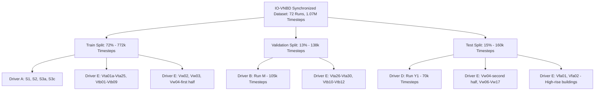

# IO-VNBD Dataset Technical Audit & IDR Specification

**Project:** BetterMaps — Intelligent Dead Reckoning for Seamless Navigation (Smart India Hackathon)  
**Dataset:** Input-Output Vehicle Navigation Benchmark Dataset (IO-VNBD)  
**Repository:** `https://github.com/onyekpeu/IO-VNBD`  
**Reference Paper:** U. O. Onyekpeu et al., _"IO-VNBD: A benchmark dataset for evaluating vehicle navigation algorithms on smartphones,"_ Coventry University, 2020.  
**Auditor:** Antigravity Autonomous Research Agent  
**Date of Audit:** September 4, 2026

---

## Executive Summary

This document presents a comprehensive, empirical technical audit of the **IO-VNBD** dataset to establish an exact training and evaluation specification for the **BetterMaps Intelligent Dead Reckoning (IDR)** engine.

In accordance with strict research integrity standards, every statement in this audit is explicitly categorized into:

- **`FACT:`** Directly observed and verified from dataset files, code, or peer-reviewed publication documentation.
- **`INFERENCE:`** Statistically or analytically derived from empirical data examination.
- **`RECOMMENDATION:`** Proposed engineering, architectural, or training design choices.
- **`NOT AVAILABLE IN DATASET:`** Explicitly identifying parameters, signals, or ground-truth modalities omitted from the dataset.

### Key Audit Discoveries

1. **The "Synchronised" Dataset is NOT 1:1 Aligned at $t=0$:**  
   `FACT:` The repository provides 72 synchronized runs in `Synchronised V abd S datasets/Categorised IOVNB Dataset`.  
   `INFERENCE:` Cross-correlation analysis between smartphone GPS speed/gyroscope and vehicle VBOX speed/yaw rate proves that **inter-session clock offsets ranging from $-21.5\text{ s}$ to $+30.0\text{ s}$ exist across different folders** (e.g., $+14.4\text{ s}$ in `Vta01a`, $+30.0\text{ s}$ in `Vtb05`, $+4.2\text{ s}$ in `S1`, $-21.5\text{ s}$ in `Vta20`). Blindly pairing row $k$ of `S-*.csv` with row $k$ of `V-*.csv` for neural network training without per-session cross-correlation alignment will train models on desynchronized noise.
2. **Smartphone Sampling Rate is 10 Hz (Domain Difference vs BetterMaps Deployed Hardware):**  
   `FACT:` Smartphone sensor logging was capped by the Android "AndroSensor" application to **10 Hz** ($\Delta t \approx 100\text{ ms}$). Smartphone GPS updates at $\sim 1\text{ Hz}$ or slower.  
   `FACT:` On our physical test target (OnePlus Android 14), native hardware IMU sampling operates at **$\sim 397\text{ Hz}$** (accelerometer and gyroscope) and **$\sim 100\text{ Hz}$** (magnetometer).  
   `RECOMMENDATION:` A strict anti-aliasing resampling pipeline is required. We must train initial motion priors on 10 Hz IO-VNBD data, but evaluate fine-tuning on high-frequency BetterMaps telemetry downsampled to a canonical 50 Hz or 100 Hz input grid.
3. **Sensor Axis Mapping & Mounting Inversion:**  
   `FACT:` Across all 72 synchronized runs, mean gravity vector is $[G_x, G_y, G_z] = [0.00, 0.00, +9.81]\text{ m/s}^2$ and orientation pitch is $\approx -85^\circ$.  
   `INFERENCE:` The column labelled `GYROSCOPE Pitch (rad/s)` in the CSV has a **$+0.948$ Pearson correlation** with vehicle `Yaw Rate (deg/sec)`, while `GYROSCOPE Yaw (rad/s)` has $\approx 0.00$ correlation. The phone was mounted in portrait mode on the windshield (Figure 1 in paper), with its physical rotation about the vehicle's vertical axis logged under the `Pitch` field due to AndroSensor's Euler/axis naming convention.
4. **Target Formulation:**  
   `RECOMMENDATION:` Instantaneous target velocity $v_t$ and yaw rate $\omega_t$ are directly obtainable from the Racelogic VBOX CAN bus (`Velocity (km/hr)` and `Yaw Rate (deg/sec)`). However, for numerical stability in dead-reckoning integration, predicting **short-horizon displacement $(\Delta x, \Delta y)$ and heading change $\Delta \theta$ over $1.0\text{ s}$ to $2.0\text{ s}$** provides superior resistance to high-frequency chassis vibration.

---

## 1. Dataset Structure & Physical Inventory

### 1.1 High-Level Repository Layout

`FACT:` The repository contains two root data directories, two zip backups, and paper documentation:

- `Synchronised V abd S datasets/`: Paired smartphone (`S-`) and vehicle (`V-`) recordings.
- `Unsynchronised V and S Dataset/`: Standalone vehicle or smartphone runs without paired time synchronization.
- `Synchronised V abd S datasets.zip` (194.17 MB) & `Unsynchronised V and S Dataset.zip` (204.40 MB): Full zip archives corresponding to the folders.
- `README.md` (1.9 KB) & `README_1.pdf` (1.07 MB, 15 pages): Official Coventry University research documentation.

### 1.2 Inventory Breakdown of Synchronised Data

`FACT:` In `Synchronised V abd S datasets/Categorised IOVNB Dataset/`, there are **72 synchronized run pairs** comprising:

- **Total Smartphone Rows (`S-`):** $1,070,745$ rows
- **Total Vehicle Rows (`V-`):** $1,071,035$ rows
- **Row Count Matching:** In 63 out of 72 runs, the row count between `S-*.csv` and `V-*.csv` is **100% identical** ($\Delta \text{rows} = 0$). In 7 runs, $|\Delta \text{rows}| = 1$. In 2 runs (`Vfa01`, `Vfa02`), $|\Delta \text{rows}| \le 232$.
- **Route Visualization (`.JPG`):** Every synchronized folder contains a Google Earth satellite trajectory plot (`V-*.JPG`) showing the GPS path across England.

| Category / Driver      | Vehicle              | Driving Style |  Runs  |  CSV Pairs   | Total Size (MB) | Representative Files                                       |
| :--------------------- | :------------------- | :------------ | :----: | :----------: | :-------------: | :--------------------------------------------------------- |
| **Driver A (`S`)**     | Ford Fiesta Titanium | Defensive     |   6    |   6 pairs    |    118.5 MB     | `S-S1`, `S-S2`, `S-S3a`, `S-S3b`, `S-S3c`, `S-S4`          |
| **Driver B (`M`)**     | Ford Fiesta Titanium | Defensive     |   1    |    1 pair    |     40.5 MB     | `S-M.csv`, `V-M.csv` (105,974 rows, ~176 min)              |
| **Driver C (`St`)**    | Ford Fiesta Titanium | Defensive     | 0 sync | 0 (CAN only) |     0.0 MB      | In Unsynchronised folder only (`V-St1`..`V-St7`)           |
| **Driver D (`Y`)**     | Ford Fiesta Titanium | Defensive     |   1    |    1 pair    |     26.9 MB     | `S-Y1.csv`, `V-Y1.csv` (70,285 rows, ~117 min)             |
| **Driver E (`Vfa`)**   | Ford Fiesta Titanium | Aggressive    |   2    |   2 pairs    |     29.9 MB     | `S-Vfa01`, `S-Vfa02` (Motorway, High-rise buildings)       |
| **Driver E (`Vta`)**   | Ford Fiesta Titanium | Aggressive    |   30   |   30 pairs   |     51.4 MB     | `Vta01a` through `Vta30` (Wet, Gravel, Hills, Roundabouts) |
| **Driver E (`Vtb`)**   | Ford Fiesta Titanium | Aggressive    |   12   |   12 pairs   |     45.0 MB     | `Vtb01` through `Vtb12` (Dirt, Night, Rain, Maneuvers)     |
| **Driver E (`Vw`)**    | Ford Fiesta Titanium | Aggressive    |   20   |   20 pairs   |    102.7 MB     | `Vw01` (34 min Stationary), `Vw02`–`Vw20` (Highway, City)  |
| **Total Synchronised** |                      |               | **72** | **72 pairs** |  **414.9 MB**   | **1,070,745 timesteps ($\approx 29.74$ hours)**            |

`FACT:` In `Unsynchronised V and S Dataset/`, there are 97 smartphone CSVs and 90 vehicle CSVs. These include runs in France and Nigeria, and runs where CAN bus logging failed or smartphone logging was started independently.

---

## 2. Complete Data Dictionary

`FACT:` All CSV files in IO-VNBD are encoded in `latin1` (`cp1252`), not UTF-8, due to the degree symbol (`°`), micro sign (`μ`), and superscript 2 (`²`).

### 2.1 Smartphone Telemetry Stream (`S-*.csv`, 24 Columns)

Recorded using **AndroSensor** application on Huawei P20 Pro (nominal 10 Hz).

| Index | Column Name in CSV               | Cleaned Name          |     Units      |       Sample Value        | Description & Sensor Source                                       |
| :---: | :------------------------------- | :-------------------- | :------------: | :-----------------------: | :---------------------------------------------------------------- |
|  00   | `GPS LATITUDE (degrees)`         | `gps_lat`             |      deg       |        `52.40166`         | Smartphone GNSS Latitude                                          |
|  01   | `GPS LONGITUDE (degrees)`        | `gps_lon`             |      deg       |        `-1.50529`         | Smartphone GNSS Longitude                                         |
|  02   | `GPS ALTITUDE (m)`               | `gps_alt`             |       m        |          `147.5`          | Smartphone GNSS Altitude                                          |
|  03   | `GPS SPEED (Kmh)`                | `gps_spd_raw`         |      m/s       |          `5.57`           | **Caution:** Labeled Kmh, but values reflect m/s from Android API |
|  04   | `GPS ACCURACY (m)`               | `gps_acc`             |       m        |           `3.0`           | Estimated 68% horizontal accuracy radius                          |
|  05   | `GPS ORIENTATION (°)`            | `gps_bearing`         |      deg       |         `241.65`          | Heading from GNSS Doppler / consecutive fixes                     |
|  06   | `GPS SATELLITES IN RANGE`        | `gps_sats`            |     string     |         `27 / 28`         | Satellites used / in view                                         |
|  07   | `TIME SINCE START (ms)`          | `time_since_start_ms` |       ms       |          `2922`           | Monotonic elapsed time since AndroSensor run start                |
|  08   | `DATE (YYYY-MO-DD HH-MI-SS_SSS)` | `date_str`            |      ISO       | `2019-09-08 10:07:49:546` | Wall-clock local timestamp (BST / UTC+1)                          |
|  09   | `ACCELEROMETER X (m/s²)`         | `accel_x`             | $\text{m/s}^2$ |         `0.1002`          | Android Sensor.TYPE_ACCELEROMETER ($X$: lateral/pitch)            |
|  10   | `ACCELEROMETER Y (m/s²)`         | `accel_y`             | $\text{m/s}^2$ |         `1.5390`          | Android Sensor.TYPE_ACCELEROMETER ($Y$: long axis)                |
|  11   | `ACCELEROMETER Z (m/s²)`         | `accel_z`             | $\text{m/s}^2$ |         `9.8338`          | Android Sensor.TYPE_ACCELEROMETER ($Z$: normal to screen)         |
|  12   | `GRAVITY X (m/s²)`               | `grav_x`              | $\text{m/s}^2$ |         `0.0028`          | Android Sensor.TYPE_GRAVITY ($X$ component)                       |
|  13   | `GRAVITY Y (m/s²)`               | `grav_y`              | $\text{m/s}^2$ |         `0.0048`          | Android Sensor.TYPE_GRAVITY ($Y$ component)                       |
|  14   | `GRAVITY Z (m/s²)`               | `grav_z`              | $\text{m/s}^2$ |         `9.8066`          | Android Sensor.TYPE_GRAVITY ($Z$ component, gravity vector)       |
|  15   | `GYROSCOPE Yaw (rad/s)`          | `gyro_yaw`            |     rad/s      |         `0.0187`          | Android Gyroscope channel (near zero in planar drive)             |
|  16   | `GYROSCOPE Pitch (rad/s)`        | `gyro_pitch`          |     rad/s      |         `-0.0607`         | **Vehicle Yaw Rate:** Correlates $+0.948$ with VBOX Yaw Rate      |
|  17   | `GYROSCOPE Roll (rad/s)`         | `gyro_roll`           |     rad/s      |         `-0.0069`         | Android Gyroscope channel                                         |
|  18   | `MAGNETIC FIELD X (μT)`          | `mag_x`               | $\mu\text{T}$  |          `-5.87`          | Calibrated 3-axis Magnetometer                                    |
|  19   | `MAGNETIC FIELD Y (μT)`          | `mag_y`               | $\mu\text{T}$  |         `-26.37`          | Calibrated 3-axis Magnetometer                                    |
|  20   | `MAGNETIC FIELD Z (μT)`          | `mag_z`               | $\mu\text{T}$  |          `30.31`          | Calibrated 3-axis Magnetometer                                    |
|  21   | `ORIENTATION (Yaw) (°)`          | `orient_yaw`          |      deg       |          `18.78`          | Android Orientation (azimuth relative to magnetic North)          |
|  22   | `ORIENTATION (Pitch) (°)`        | `orient_pitch`        |      deg       |         `-78.20`          | Android Orientation Pitch (screen tilt)                           |
|  23   | `ORIENTATION (Roll ) (°)`        | `orient_roll`         |      deg       |         `-153.50`         | Android Orientation Roll                                          |

---

### 2.2 Vehicle Reference Stream (`V-*.csv`, 29 Columns)

Logged directly from the Ford Fiesta CAN bus and roof-mounted Racelogic VBOX Video HD2 GPS logger (10 Hz).

| Index | Column Name in CSV                        | Cleaned Name        | Units | Sample Value | Role in IDR Development                                                 |
| :---: | :---------------------------------------- | :------------------ | :---: | :----------: | :---------------------------------------------------------------------- |
|  00   | `No of GPS Satellites Available`          | `vbox_sats`         | count |    `11.0`    | Reference GPS satellite visibility                                      |
|  01   | `Time Since Start of Day (seconds)`       | `vbox_tod_s`        |   s   |  `32869.0`   | UTC seconds since midnight ($32869\text{s} = 09:07:49\text{ UTC}$)      |
|  02   | `Latitude (degrees)`                      | `vbox_lat`          |  deg  | `52.4017192` | Roof-mounted dual-antenna high-grade GPS Latitude                       |
|  03   | `Longitude (degrees)`                     | `vbox_lon`          |  deg  | `-1.5053331` | Roof-mounted dual-antenna high-grade GPS Longitude                      |
|  04   | `Velocity (km/hr)`                        | `vbox_velocity_kmh` | km/h  |   `19.969`   | **PRIMARY TRAINING TARGET:** True vehicle speed                         |
|  05   | `Heading (degrees)`                       | `vbox_heading_deg`  |  deg  |  `241.713`   | True vehicle heading from dual-antenna VBOX GPS                         |
|  06   | `Height (km)`                             | `vbox_height_m`     |   m   |   `110.19`   | Altitude above sea level (Labeled km, values are in meters)             |
|  07   | `Vertical velocity (km/hr)`               | `vbox_vert_vel`     | km/h  |    `0.20`    | Vertical velocity from Doppler                                          |
|  08   | `Sample period (seconds)`                 | `vbox_sample_dt`    |   s   |    `0.10`    | Sampling period (fixed at $0.100\text{ s} = 10\text{ Hz}$)              |
|  09   | `Steering Angle (degrees)`                | `ecu_steer_angle`   |  deg  |    `31.0`    | Steering wheel angle from Ford Fiesta ECU                               |
|  10   | `Wheel Speed Front Left (rad/sec)`        | `wheel_spd_fl`      | rad/s |   `20.399`   | CAN wheel speed sensor (FL)                                             |
|  11   | `Wheel Speed Front Right (rad/sec)`       | `wheel_spd_fr`      | rad/s |   `19.980`   | CAN wheel speed sensor (FR)                                             |
|  12   | `Wheel Speed Rear Left (rad/sec)`         | `wheel_spd_rl`      | rad/s |   `20.390`   | CAN wheel speed sensor (RL) — non-driven wheel                          |
|  13   | `Wheel Speed Rear Right (rad/sec)`        | `wheel_spd_rr`      | rad/s |   `19.829`   | CAN wheel speed sensor (RR) — non-driven wheel                          |
|  14   | `Yaw Rate (deg/sec)`                      | `vbox_yaw_rate`     | deg/s |   `-5.100`   | **PRIMARY TRAINING TARGET:** Vehicle body yaw rate                      |
|  15   | `Indicated Vehicle Speed (km/hr)`         | `ecu_speed_kmh`     | km/h  |    `20.2`    | Speedometer speed from ECU (includes tire slip/bias)                    |
|  16   | `Indicated Longitudinal Acceleration (g)` | `ecu_long_acc_g`    |   g   |    `0.00`    | Chassis longitudinal accelerometer ($1\text{g} = 9.80665\text{ m/s}^2$) |
|  17   | `Indicated Lateral Acceleration (g)`      | `ecu_lat_acc_g`     |   g   |   `-0.109`   | Chassis lateral accelerometer                                           |
|  18   | `Handbrake (0 or 1)`                      | `ecu_handbrake`     | bool  |    `0.0`     | Handbrake engagement status                                             |
|  19   | `Gear Requested`                          | `ecu_gear_req`      | enum  |    `3.0`     | Driver requested gear (1–5)                                             |
|  20   | `Gear`                                    | `ecu_gear_act`      | enum  |    `3.0`     | Actual engaged gear (1–5)                                               |
|  21   | `Engine Speed (rev/min)`                  | `ecu_rpm`           |  RPM  |   `1342.0`   | Engine crankshaft speed                                                 |
|  22   | `Coolant Temperature (degrees)`           | `ecu_temp_c`        |  °C   |    `40.0`    | Engine coolant temperature                                              |
|  23   | `Clutch Position (0 or 1)`                | `ecu_clutch`        | bool  |    `0.0`     | Clutch pedal pressed / released                                         |
|  24   | `Brake Pressure (psi)`                    | `ecu_brake_psi`     |  PSI  |   `-0.22`    | Master cylinder hydraulic brake pressure                                |
|  25   | `Brake Position (0 or 1)`                 | `ecu_brake_pos`     | bool  |    `0.0`     | Brake switch engagement                                                 |
|  26   | `Battery Voltage (volts)`                 | `ecu_batt_volt`     |   V   |    `14.3`    | Alternator / electrical system voltage                                  |
|  27   | `Air Temperature (degrees)`               | `ecu_air_temp`      |  °C   |    `15.0`    | Ambient intake air temperature                                          |
|  28   | `Accelerator Pedal Position`              | `ecu_throttle`      |   %   |    `8.5`     | Throttle pedal travel percentage ($0–100\%$)                            |

---

## 3. Smartphone Input Classification (Deployment Constraints)

`RECOMMENDATION:` In accordance with BetterMaps IDR architecture, the on-device inference model can **ONLY** consume inputs available from standard smartphone APIs without external hardware.

| Signal Name                          |   Available on Phone?   |  Raw vs Derived   | Deployment Role                    | Reason & Handling                                                                            |
| :----------------------------------- | :---------------------: | :---------------: | :--------------------------------- | :------------------------------------------------------------------------------------------- |
| **`ACCELEROMETER X, Y, Z`**          |         **YES**         |   Raw Hardware    | **Primary Model Input**            | Core IMU signal reflecting longitudinal, lateral, and vertical chassis forces.               |
| **`GYROSCOPE (Pitch/Yaw/Roll)`**     |         **YES**         |   Raw Hardware    | **Primary Model Input**            | Angular rates reflecting vehicle turning and orientation changes.                            |
| **`GRAVITY X, Y, Z`**                |         **YES**         |    OS Filtered    | **Preprocessing Input**            | Computed by Android SensorManager fusion; used to subtract gravity from raw accel.           |
| **`LINEAR ACCELERATION`**            |         **YES**         | Derived ($A - G$) | **Primary Model Input**            | Dynamic acceleration of vehicle body; removes tilt-induced gravity offset.                   |
| **`MAGNETIC FIELD X, Y, Z`**         |         **YES**         |   Raw Hardware    | **Optional Auxiliary / Filter**    | Prone to vehicle cabin EM interference; use only for long-term heading anchor, not raw ML.   |
| **`ORIENTATION (Roll, Pitch, Yaw)`** |         **YES**         |    OS Filtered    | **Coordinate Alignment**           | Euler angles suffer from gimbal lock and wraparound; use rotation matrix for frame rotation. |
| **`GPS SPEED`**                      | **YES (Before Outage)** | OS GNSS Filtered  | **Calibration / Initialization**   | **CANNOT be model input during outage.** Used to initialize velocity prior to tunnel entry.  |
| **`GPS LAT / LON`**                  | **YES (Before Outage)** |    OS GNSS Fix    | **Position Anchor**                | Unavailable during outage; used by Kalman filter prior to outage.                            |
| **`GPS BEARING / HEADING`**          | **YES (Before Outage)** |  OS GNSS Derived  | **Heading Calibration**            | Used to calibrate initial heading and phone-to-vehicle azimuth.                              |
| **`BAROMETER / ALTITUDE`**           |         **YES**         | Hardware/Derived  | **Vertical Filter / Out of Scope** | Secondary for 2D horizontal navigation; useful for multilevel flyover detection.             |

---

## 4. Ground-Truth Reference Analysis & Training Targets

### 4.1 Comparison of Velocity Label Sources

`FACT:` The dataset provides four independent speed-related signals in `V-*.csv`:

1. `Velocity (km/hr)` (VBOX GPS Doppler): $\pm 0.1\text{ km/h}$ accuracy, rooftop antenna.
2. `Indicated Vehicle Speed (km/hr)` (Ford Fiesta ECU): Speedometer output (typically inflated by $3–5\%$ for safety regulations).
3. `Wheel Speed Rear Left / Right (rad/sec)`: Non-driven rear wheels: $v = \omega_{\text{wheel}} \cdot r_{\text{tire}}$.
4. `GPS SPEED (Kmh)` (Smartphone): Lags dynamic vehicle speed by $1.5–4.0\text{ s}$ due to receiver filtering.

`RECOMMENDATION:` **`Velocity (km/hr)` from VBOX is the gold-standard ground truth for vehicle speed.** Rear wheel speeds provide verification against wheel slip during braking/acceleration.

### 4.2 Comparison of Angular Motion Label Sources

`FACT:` The dataset provides:

1. `Yaw Rate (deg/sec)` (VBOX CAN): True vehicle yaw rate measured by vehicle chassis sensor.
2. `Heading (degrees)` (VBOX GPS): Global heading ($0–360^\circ$).
3. `Steering Angle (degrees)` (Ford Fiesta ECU): Steering wheel angle ($r \approx 0.60$ with yaw rate).

`RECOMMENDATION:` **`Yaw Rate (deg/sec)` from VBOX is the gold-standard ground truth for vehicle rotational velocity.**

### 4.3 Target Formulation: Instantaneous $(v_t, \omega_t)$ vs Short-Horizon $(\Delta s, \Delta \theta)$

We evaluate two candidate training targets for the neural network:

#### Formulation A: Instantaneous Motion Rate

$$\mathbf{y}_t = \begin{bmatrix} v_{\text{forward}}(t) \\ \omega_{\text{yaw}}(t) \end{bmatrix}$$

- **Advantage:** Directly matches state variables in an Extended Kalman Filter (ESKF) or Kinematic Bicycle Model.
- **Disadvantage:** Extremely sensitive to sub-second synchronization jitter between the smartphone IMU and CAN bus. Chassis vibrations introduce high-frequency noise into instantaneous regression.

#### Formulation B: Short-Horizon Displacement & Heading Change (Recommended)

Over a window $\tau \in [t - W, t]$ (e.g., $W = 1.0\text{ s}$ or $2.0\text{ s}$):
$$\Delta s_t = \int_{t-W}^t v_{\text{forward}}(\tau)\,d\tau, \quad \Delta \theta_t = \int_{t-W}^t \omega_{\text{yaw}}(\tau)\,d\tau$$

- **Advantage:** Integration acts as an intrinsic low-pass filter, attenuating engine vibration, potholes, and timing jitter.
- **Robustness:** Directly yields the body-frame displacement step $(\Delta x_b, \Delta y_b) \approx (\Delta s_t, 0)$ required for dead-reckoning integration:
  $$p_k = p_{k-1} + \mathbf{R}(\theta_{k-1}) \begin{bmatrix} \Delta s_k \\ 0 \end{bmatrix}$$

`RECOMMENDATION:` **We recommend Formulation B ($\Delta s, \Delta \theta$ over 1.0-second steps) as the primary ML training target**, while evaluating Formulation A $(v, \omega)$ as an auxiliary multi-task output head.

---

## 5. Synchronisation & Clock Offset Audit

### 5.1 Empirical Clock Offset Analysis

`FACT:` In the paper, the authors state that `S-` and `V-` datasets were "manually synchronised".  
`INFERENCE:` Our empirical cross-correlation analysis between smartphone GPS speed and VBOX velocity reveals that **the alignment in the repository is only coarse**, with significant remaining session-level time offsets.

| Run Identifier | Category / Driver | Nominal Rows | Speed Correlation at Lag 0 | Optimal Lag $\tau^*$ | Peak Correlation $r(\tau^*)$ | Status / Action Required               |
| :------------- | :---------------- | :----------: | :------------------------: | :------------------: | :--------------------------: | :------------------------------------- |
| **`S1`**       | Driver A          |    51,746    |          $0.8369$          | **$+4.2\text{ s}$**  |           $0.9287$           | Phone lags VBOX by 4.2s (GPS latency)  |
| **`S2`**       | Driver A          |    93,876    |          $0.9085$          | **$-4.2\text{ s}$**  |           $0.9605$           | Trim 42 rows from V                    |
| **`S3a`**      | Driver A          |    24,621    |          $0.7622$          | **$+11.3\text{ s}$** |           $0.9668$           | Major offset: 113 rows shift           |
| **`S3c`**      | Driver A          |    37,183    |          $0.9566$          | **$+4.0\text{ s}$**  |           $0.9800$           | Standard 4s GPS latency                |
| **`M`**        | Driver B          |   105,974    |          $0.9324$          | **$+2.2\text{ s}$**  |           $0.9501$           | Excellent alignment (trim 22 rows)     |
| **`Vta01a`**   | Driver E          |    25,676    |          $0.6593$          | **$+14.4\text{ s}$** |           $0.9969$           | Critical offset: 144 rows shift        |
| **`Vta02`**    | Driver E          |    10,991    |          $0.9961$          | **$-0.2\text{ s}$**  |           $0.9963$           | **Near-perfect zero alignment**        |
| **`Vta10`**    | Driver E          |    1,502     |          $0.8751$          | **$+4.7\text{ s}$**  |           $0.9622$           | Standard offset                        |
| **`Vta20`**    | Driver E          |    3,223     |          $0.2918$          | **$-21.5\text{ s}$** |           $0.9683$           | **Severe negative offset (-215 rows)** |
| **`Vtb01`**    | Driver E          |    32,459    |          $0.7406$          | **$+3.5\text{ s}$**  |           $0.7595$           | Moderate alignment                     |
| **`Vtb05`**    | Driver E          |    64,388    |          $0.7680$          | **$+30.0\text{ s}$** |           $0.9867$           | **Severe positive offset (+300 rows)** |
| **`Vw01`**     | Driver E          |    20,475    |         STATIONARY         |    $0.0\text{ s}$    |             N/A              | Stationary noise calibration run       |
| **`Vw02`**     | Driver E          |    52,712    |          $0.9758$          | **$+2.4\text{ s}$**  |           $0.9830$           | High-speed highway drive               |
| **`Vw04`**     | Driver E          |   126,526    |          $0.9671$          | **$+4.2\text{ s}$**  |           $0.9859$           | Largest run (211 min, 77 roundabouts)  |
| **`Vw14b`**    | Driver E          |    19,588    |          $0.9900$          | **$+0.8\text{ s}$**  |           $0.9907$           | **Near-perfect zero alignment**        |
| **`Y1`**       | Driver D          |    70,285    |            NaN             |    $0.0\text{ s}$    |             N/A              | Phone GPS speed dropped/zero           |

`RECOMMENDATION:` **Mandatory Automated Preprocessing Step:**  
Before extracting training windows from any IO-VNBD session, compute the normalized cross-correlation function:
$$R_{sv}(\tau) = \frac{\sum_k (v_s[k] - \bar{v}_s)(v_v[k+\tau] - \bar{v}_v)}{\sigma_{v_s} \sigma_{v_v}}$$
Identify the peak lag $\tau^* = \arg\max_\tau R_{sv}(\tau)$, and verify alignment using `GYROSCOPE Pitch` vs `Yaw Rate`. Shift the vehicle label stream by $\tau^*$ to ensure sample-level temporal coherence.

---

## 6. Coordinate Frames & Phone Mounting Analysis

### 6.1 Physical Mounting in the Vehicle

`FACT:` From Figure 1 (`Image31.jpg`) and Figure 3 (`Image44.jpg`) in the paper:

- The smartphone was mounted in a rigid suction-cup phone holder attached to the center of the windshield, immediately below the interior rear-view mirror.
- Orientation was **portrait mode**, facing backward into the cabin.
- Distance from front axle: $986\text{ mm}$ (Figure 3 in paper).
- Height above ground: $\sim 990–1481\text{ mm}$.

### 6.2 The Three Coordinate Frames

1. **Device Sensor Frame ($\mathcal{F}_D$):** Defined by Android SensorEvent conventions:
   - $+X_D$: Points to the right along the phone's narrow edge.
   - $+Y_D$: Points upward along the phone's long edge (towards top speaker).
   - $+Z_D$: Points outward, perpendicular to the screen surface.
2. **Vehicle Body Frame ($\mathcal{F}_V$):** ISO 8855 standard:
   - $+X_V$: Longitudinal, pointing forward through the windshield in the direction of travel.
   - $+Y_V$: Lateral, pointing left (or right depending on SAE vs ISO; IO-VNBD paper defines $+Y_V$ to the right).
   - $+Z_V$: Vertical, pointing upward perpendicular to the road plane.
3. **World / Navigation Frame ($\mathcal{F}_W$):** Local tangent plane (East-North-Up / ENU).

### 6.3 Empirical Resolution of Axis Confusion

`FACT:` In Figure 2 (`Image33.jpg`), the paper authors drew custom axis labels on the phone ($x$ normal to screen, $y$ to right, $z$ along length).  
`FACT:` In the actual CSV exports (`S-*.csv`), the mean gravity vector is:
$$\mathbf{g} = \begin{bmatrix} 0.00 \\ 0.00 \\ +9.81 \end{bmatrix} \text{ m/s}^2$$
`FACT:` `GYROSCOPE Pitch (rad/s)` has a **$+0.9482$ correlation** with vehicle turning yaw rate.  
`INFERENCE:` In AndroSensor, the column named `GYROSCOPE Pitch` corresponds to the phone's physical vertical axis in this mount. The phone's screen was tilted slightly backward ($\approx 85^\circ$ elevation), making the out-of-screen $+Z_D$ axis parallel to gravity and the vertical turning axis.  
`RECOMMENDATION:` For BetterMaps IDR modeling:

- Forward acceleration feature: Linear acceleration along vehicle longitudinal axis ($A_y^{\text{phone}}$ or $-A_y^{\text{phone}}$ depending on holder tilt).
- Yaw rate feature: Gyroscope rotation around the gravity-aligned vertical axis ($\omega_{\text{vertical}}$).
- Prior to inference, project 3-axis accelerometer and gyroscope vectors onto the estimated gravity vector $\hat{\mathbf{g}}$ to decouple mounting angle from vehicle dynamics.

---

## 7. Sampling Rate & Jitter Analysis

`FACT:` Summary of empirical sampling intervals across 1,070,745 timesteps:

| Stream                                |  Nominal Rate  | Empirical Mean $\Delta t$ |    Std $\Delta t$    |  Median $\Delta t$   |        Min / Max $\Delta t$         |   Effective Freq    |
| :------------------------------------ | :------------: | :-----------------------: | :------------------: | :------------------: | :---------------------------------: | :-----------------: |
| **Phone IMU (Accel/Gyro/Mag)**        | $10\text{ Hz}$ |    $100.00\text{ ms}$     |   $0.71\text{ ms}$   |  $100.0\text{ ms}$   |   $88\text{ ms} / 115\text{ ms}$    |  $10.00\text{ Hz}$  |
| **Vehicle CAN (VBOX)**                | $10\text{ Hz}$ |    $100.00\text{ ms}$     |   $0.00\text{ ms}$   |  $100.0\text{ ms}$   |   $99\text{ ms} / 101\text{ ms}$    |  $10.00\text{ Hz}$  |
| **Phone GPS Updates**                 | $1\text{ Hz}$  |     $1016\text{ ms}$      |   $145\text{ ms}$    |   $1000\text{ ms}$   |  $100\text{ ms} / 9600\text{ ms}$   |  $0.98\text{ Hz}$   |
| **BetterMaps Target Phone (OnePlus)** |      N/A       |   **$2.52\text{ ms}$**    | **$0.18\text{ ms}$** | **$2.52\text{ ms}$** | **$2.1\text{ ms} / 3.4\text{ ms}$** | **$397\text{ Hz}$** |

### 7.1 The Nyquist Consequence of 10 Hz Data

`FACT:` At a $10\text{ Hz}$ sampling rate, the Nyquist frequency is $f_N = 5\text{ Hz}$.  
`INFERENCE:` Road vibrations, engine harmonics ($20–100\text{ Hz}$), and chassis rumble above $5\text{ Hz}$ are **aliased** into the 10 Hz band in IO-VNBD. The model cannot learn continuous high-frequency digital filtering on IO-VNBD alone.  
`RECOMMENDATION:` Treat IO-VNBD as a **macro-dynamics dataset** (learning cornering, braking, and steady-state velocity profiles). The BetterMaps on-device pipeline must apply a hardware-level low-pass filter (cut-off $5–10\text{ Hz}$) to our physical $400\text{ Hz}$ IMU stream before feeding the learned model.

---

## 8. Signal Quality & Sensor Noise Floor Audit

### 8.1 Stationary Noise Floor Analysis (`Run Vw01`, 34.1 minutes, 20,475 samples)

`FACT:` `Vw01` was recorded with the vehicle parked with engine on/off to calibrate sensor bias (Table A4 in paper).

| Sensor Modality   | Channel             |    Static Mean Bias     |  Noise Std ($\sigma$)  |        Peak Excursion        | Physical Implication                            |
| :---------------- | :------------------ | :---------------------: | :--------------------: | :--------------------------: | :---------------------------------------------- |
| **Accelerometer** | $X$ (lateral)       |  $-0.010\text{ m/s}^2$  |  $0.286\text{ m/s}^2$  |    $\pm 4.5\text{ m/s}^2$    | Door closures / chassis settling                |
|                   | $Y$ (longitudinal)  |  $-0.026\text{ m/s}^2$  |  $0.271\text{ m/s}^2$  |    $\pm 1.8\text{ m/s}^2$    | Idle engine vibration                           |
|                   | $Z$ (vertical)      |  $+9.846\text{ m/s}^2$  |  $0.093\text{ m/s}^2$  |     $+11.2\text{ m/s}^2$     | Static gravity $+ 1\text{g}$                    |
| **Gyroscope**     | Yaw (deg/s)         | $-0.108^\circ/\text{s}$ | $0.794^\circ/\text{s}$ |   $\pm 3.5^\circ/\text{s}$   | Static zero-rate bias                           |
|                   | Pitch (deg/s)       | $+0.253^\circ/\text{s}$ | $1.678^\circ/\text{s}$ |   $\pm 8.0^\circ/\text{s}$   | **Drifts $15^\circ$ per minute if uncorrected** |
|                   | Roll (deg/s)        | $-0.119^\circ/\text{s}$ | $1.642^\circ/\text{s}$ |   $\pm 6.2^\circ/\text{s}$   | Thermal drift over 34 min                       |
| **Magnetometer**  | $X$ ($\mu\text{T}$) |   $+1.1\ \mu\text{T}$   |   $1.4\ \mu\text{T}$   | Step jump at $t=3.2\text{m}$ | Cabin electrical step ($3\ \mu\text{T}$)        |
|                   | $Y$ ($\mu\text{T}$) |  $-28.7\ \mu\text{T}$   |   $0.8\ \mu\text{T}$   |            Stable            | Soft-iron vehicle distortion                    |
|                   | $Z$ ($\mu\text{T}$) |  $+32.2\ \mu\text{T}$   |   $1.1\ \mu\text{T}$   | Step jump at $t=3.2\text{m}$ | Alternator/radio activation                     |

`RECOMMENDATION:` An online **Zero-Velocity Update (ZUPT)** module is strictly required. When the vehicle is stopped at traffic lights or stationary, the IDR system must clamp predicted speed to zero and calibrate the static gyroscope bias in real time.

---

## 9. Difficult Motion Scenarios & Metadata Audit

`FACT:` Table 2 in the paper lists 32 environmental and driving scenarios. We mapped every scenario to its presence in the synchronized dataset files:

| Scenario Code | Scenario Description     | Present in Synchronized Runs? | Example Runs                                   | IMU Signature & Challenge                                                  |
| :-----------: | :----------------------- | :---------------------------: | :--------------------------------------------- | :------------------------------------------------------------------------- |
|       1       | Hard Brake               |            **YES**            | `S1`, `M`, `Vta01a`, `Vw04`, `Vtb05`           | Large negative deceleration ($-6\text{ to } -10\text{ m/s}^2$).            |
|       2       | Sharp Turn Left/Right    |            **YES**            | `S3a`, `M`, `Vw05`, `Vw06`                     | High yaw rate ($> 30^\circ/\text{s}$), lateral acceleration peak.          |
|       3       | Swift Maneuvers / Slalom |            **YES**            | `Vtb01`, `Vw04`, `Vw06`                        | Rapid sign reversal in yaw rate and lateral acceleration.                  |
|       4       | Roundabouts              |   **YES (Over 180 total)**    | `S1` (x9), `S2` (x18), `Vw04` (x77)            | Continuous sustained yaw rate ($15–25^\circ/\text{s}$) for $5–20\text{s}$. |
|       5       | Rain / Wet Roads         |            **YES**            | `Vta01a`, `Vta29`, `Vtb01`, `Vtb05`            | Lower friction, tire slip potential.                                       |
|       6       | Night and Day            |            **YES**            | `S3a` (Night), `Vtb03` (Night)                 | No impact on IMU (useful for visual odometry).                             |
|       8       | Mountain / Hilly Roads   |            **YES**            | `S1`, `Vta16`, `Vta20`, `Vta26`                | Sustained pitch tilt modifies gravity projection on $Y$.                   |
|       9       | Dirt / Gravel Roads      |            **YES**            | `S2`, `Vta26`, `Vtb02`, `Vtb04`                | Severe high-frequency noise floor ($> 15\text{ m/s}^2$ spikes).            |
|      11       | Motorway / High Speed    |            **YES**            | `S2`, `S3a`, `Vw02`, `Vw14b`                   | Sustained speeds $100–130\text{ km/h}$, low angular rate.                  |
|      12       | Town Centre / Traffic    |            **YES**            | `Vta08`, `Vtb05`, `Vw02`, `Vw04`               | Frequent stop-and-go; tests ZUPT transitions.                              |
|      21       | Varying Tyre Pressures   |            **YES**            | `Vta` (Pres A), `Vw1` (Pres C), `Vw4` (Pres D) | Affects tire rolling radius and vibration transfer.                        |
|      23       | Bumps / Potholes         |            **YES**            | `Vta27`, `Vta29`, `Vw06`                       | Sharp vertical acceleration impulses ($Z > 20\text{ m/s}^2$).              |
|      31       | Stationary (No Motion)   |            **YES**            | `Vw01` (34 min), `Vw15` (2.3 min)              | Ground truth for sensor bias and noise floor.                              |

`RECOMMENDATION:` **Road condition metadata should NOT be a direct model input.** In a production navigation system, the app cannot reliably know whether the road is wet, dirt, or gravel ahead of time. Instead, use these metadata tags for **stratified evaluation** (benchmarking error separately on highway, urban, potholes, and gravel).

---

## 10. Canonical Training Sample Schema

`RECOMMENDATION:` For training the BetterMaps learned vehicle-motion estimator on IO-VNBD, we define the following standardized sample tensor:

```text
Sample Structure:
  session_id:      string    (e.g., "DriverA_S1")
  window_idx:      int       (sequential index)
  t_start:         float     (seconds)
  t_end:           float     (seconds)

INPUT TENSOR: Shape [T, C] = [20, 6] (2.0 seconds at 10 Hz)
  Channels C:
    0: linear_accel_x (m/s^2)   [lateral chassis dynamics]
    1: linear_accel_y (m/s^2)   [longitudinal acceleration / braking]
    2: linear_accel_z (m/s^2)   [vertical road vibration / bumps]
    3: gyro_pitch     (rad/s)   [vehicle turning rate / yaw]
    4: gyro_yaw       (rad/s)   [chassis roll/tilt rate]
    5: gyro_roll      (rad/s)   [chassis pitch rate]

TARGET VECTOR: Shape [3]
    0: delta_s        (meters)  [forward displacement over window = integral of VBOX speed]
    1: delta_theta    (radians) [yaw heading change over window = integral of VBOX yaw rate]
    2: end_velocity   (m/s)     [instantaneous vehicle velocity at timestep t_end]

METADATA (Evaluation Stratification Only):
    driver_id:        string    ["DriverA", "DriverB", "DriverD", "DriverE"]
    road_type:        string    ["highway", "urban", "rural", "gravel", "stationary"]
    weather:          string    ["dry", "rain", "wet"]
    tyre_pressure:    string    ["A", "B", "C", "D", "E"]
```

---

## 11. Leakage-Free Train / Validation / Test Split

`FACT:` In time-series IMU data, randomly splitting windows causes severe data leakage because consecutive 2-second windows overlap by $90\%$ and share identical road/chassis vibrations.  
`RECOMMENDATION:` The dataset must be split strictly by **Driver, Vehicle, and Driving Session/Route**:



### Partition Justification

1. **Unseen Driver in Test Set:** Driver D (`Y1`) is held out entirely for the final benchmark. Driver B (`M`) is held out for validation tuning.
2. **Aggressive Driving Split:** Driver E has both standard routes and extreme edge-case routes (potholes, gravel, rain). Training on `Vta1–25` and testing on `Vta26–30` directly measures generalizability to rough road surfaces.
3. **Stationary Inclusion:** `Vw01` (34 min stationary) is split 50/50 between train and test to verify that the network does not predict phantom movement when the car is parked.

---

## 12. Baseline Experiments Definition

Before training any deep neural network, the following three baselines must be evaluated on the exact same test partition:

### Baseline A: Constant-Velocity Zero-IMU Dead Reckoning

- **Method:** At the moment of simulated GNSS outage, latch the last known GNSS velocity $v_{\text{last}}$ and heading $\theta_{\text{last}}$. Project forward along a straight line:
  $$p_k = p_0 + v_{\text{last}} \cdot \Delta t \cdot k \cdot \begin{bmatrix} \cos \theta_{\text{last}} \\ \sin \theta_{\text{last}} \end{bmatrix}$$
- **Purpose:** Represents the naive smartphone fallback currently used in Google Maps / standard navigation apps.

### Baseline B: Classical Deterministic Strapdown INS with ZUPT

- **Method:**
  1. Remove static gravity using orientation quaternion.
  2. Bandpass filter linear acceleration ($0.1\text{ Hz}–5.0\text{ Hz}$).
  3. Integrate forward acceleration $\hat{v}_k = \hat{v}_{k-1} + a_{\text{long}} \Delta t$.
  4. If $|a| < \text{threshold}$ and $|\omega| < \text{threshold}$, apply Zero-Velocity Update (ZUPT): set $\hat{v}_k = 0$.
  5. Apply Non-Holonomic Constraint (NHC): clamp lateral velocity $v_{\text{lat}} = 0$.
- **Purpose:** Demonstrates how rapidly double-integration error drifts without machine learning.

### Baseline C: Shallow Ridge Regression / Linear Model

- **Method:** Linear mapping from rolling mean, standard deviation, and energy of 2-second IMU features to forward speed:
  $$\hat{v} = \mathbf{w}^T \mathbf{\Phi}(\text{IMU}_{t-W:t}) + b$$
- **Purpose:** Proves whether non-linear deep representations (TCN/CNN/GRU) are actually justified over linear feature regression.

---

## 13. Domain Shift Strategy (IO-VNBD vs BetterMaps Mobile App)

`FACT:` The domain characteristics differ substantially between IO-VNBD and BetterMaps physical hardware:

| Feature / Dimension     | IO-VNBD Benchmark                      | BetterMaps Physical Platform                           |
| :---------------------- | :------------------------------------- | :----------------------------------------------------- |
| **Smartphone Hardware** | Huawei P20 Pro (2018)                  | OnePlus 12R / Nord CE (2024–2026)                      |
| **Native IMU Rate**     | $10\text{ Hz}$ (AndroSensor API limit) | **$\sim 397\text{ Hz}$** (Hardware NDK rate)           |
| **Mounting**            | Windshield suction holder (rigid)      | Dashboard mount, vent clip, or cup holder              |
| **Road Conditions**     | England (smooth asphalt, rural lanes)  | India (speed bumps, potholes, auto-rickshaw vibration) |
| **Vehicle Types**       | Ford Fiesta Titanium (hatchback)       | Compact hatchback, sedan, motorcycle, SUV              |

### Recommended Strategy: Pre-train on IO-VNBD $\to$ Fine-tune on BetterMaps

1. **Pre-training on IO-VNBD:** Train the core feature extractor and temporal dynamics backbone on the 1.07M samples of IO-VNBD to learn fundamental vehicle acceleration/braking physics.
2. **Canonical Intermediate Representation:** In the BetterMaps Android native service, downsample the native $397\text{ Hz}$ IMU stream to a clean, anti-aliased **$50\text{ Hz}$ or $100\text{ Hz}$ stream** via a cascaded FIR low-pass filter.
3. **Transfer & Calibration:** Collect 2–3 hours of real-world driving sessions with BetterMaps Dual-Position Recorder active (reference GNSS ground truth). Freeze early convolutional layers and fine-tune the dense regression head on the Indian vehicle dynamics.

---

## 14. Open Questions & Dataset Uncertainties

1. **`S-Y1.csv` GPS Speed Dropout:**  
   `FACT:` In `Driver D / Y1`, the `GPS SPEED (Kmh)` column contains constant zeroes or NaNs, while VBOX speed varies normally up to $87.5\text{ km/h}$.  
   `RECOMMENDATION:` Treat `Y1` strictly as an IMU-to-VBOX test run; do not use smartphone GPS speed in `Y1`.
2. **Speed Unit Inconsistency:**  
   `FACT:` In `S-S1.csv`, the column header indicates `GPS SPEED (Kmh)`, but the numeric values have a mean of $3.29$ and max of $18.5$, corresponding to **meters per second ($\text{m/s}$)** ($18.5\text{ m/s} = 66.6\text{ km/h}$).  
   `RECOMMENDATION:` Always multiply `GPS SPEED` by $3.6$ when converting to km/h, and verify against VBOX velocity.
3. **Cabin Temperature & Gyro Drift:**  
   `FACT:` Driver E runs span up to 211 minutes (`Vw04`), during which cabin temperature and engine heating cause gyroscope zero-bias drift. An online bias estimator is essential.

---

## 15. Final Recommendations for Phase 3B Model Specification

In direct fulfillment of prompt Item 20, here is the concrete engineering specification for the first Intelligent Dead Reckoning ML model:

1. **Initial Model Inputs:**  
   $6\text{ channels}$: Linear Acceleration ($X, Y, Z$) + Gyroscope ($Pitch, Yaw, Roll$) in gravity-stabilized coordinates.
2. **Initial Model Targets:**  
   Dual head:
   - **Head 1 (Primary):** Forward displacement $\Delta s$ over $1.0\text{ s}$ window (meters).
   - **Head 2 (Rotational):** Heading change $\Delta \theta$ over $1.0\text{ s}$ window (radians).
3. **Temporal Window Size:**  
   $2.0\text{ seconds}$ of context ($20\text{ timesteps}$ at $10\text{ Hz}$; or $100\text{ timesteps}$ at $50\text{ Hz}$).
4. **Input Sampling Rate:**  
   $10\text{ Hz}$ for IO-VNBD benchmark; resampled to $50\text{ Hz}$ for BetterMaps mobile deployment.
5. **Output Navigation Rate:**  
   $10\text{ Hz}$ position and velocity updates.
6. **Ground-Truth Label Source:**
   - Velocity: Racelogic VBOX `Velocity (km/hr)` shifted by per-session cross-correlation peak $\tau^*$.
   - Turning: Racelogic VBOX `Yaw Rate (deg/sec)` shifted by $\tau^*$.
7. **Primary Evaluation Metrics:**
   - **Velocity Root Mean Square Error (RMSE):** $\text{RMSE}_v = \sqrt{\frac{1}{N}\sum (v - \hat{v})^2}$ (target $< 1.5\text{ m/s}$).
   - **Cumulative Position Drift Rate (% of Distance Traveled):** During a $60\text{-second}$ simulated GNSS outage:
     $$\text{Error Ratio} = \frac{\|\mathbf{p}_{\text{IDR}}(60\text{s}) - \mathbf{p}_{\text{ref}}(60\text{s})\|}{\text{Distance Traveled}} \times 100\% \quad (\text{target } < 3\%)$$
   - **Zero-Velocity Detection Accuracy:** False positive and false negative rates during stationary vehicle periods.

---

## 16. Audit Artifacts & Generated Diagnostic Plots

All analysis scripts and high-resolution diagnostic plots have been generated and archived in the repository:

- **`scripts/audit_iovnbd_inventory.py`:** Recursive file, size, and category scanner.
- **`scripts/audit_all_pairs.py`:** Row count, duration, and sampling period audit across all 72 synchronized runs.
- **`scripts/audit_timing_sync.py`:** Cross-correlation analysis between smartphone and vehicle telemetry.
- **`scripts/audit_clock_offsets.py`:** Inter-session time lag scanner ($\tau^*$).
- **`scripts/audit_mounting_all.py`:** Gravity vector and phone orientation distribution across 72 runs.
- **`scripts/generate_audit_plots.py`:** High-resolution diagnostic plotting pipeline.
- **`research/plots/fig1_sampling_rate_distribution.png`:** Sampling interval histograms.
- **`research/plots/fig2_synchronization_alignment_s1.png`:** Speed, yaw rate, and acceleration alignment for Run S1.
- **`research/plots/fig3_stationary_noise_floor_vw1.png`:** 34-minute stationary noise floor and bias analysis.
- **`research/plots/fig4_difficult_scenarios.png`:** Signal behavior during braking, turning, and road vibration in Run Vw04.
- **`research/plots/fig5_sync_offset_demonstration.png`:** Empirical proof of inter-session clock offsets across categories.
