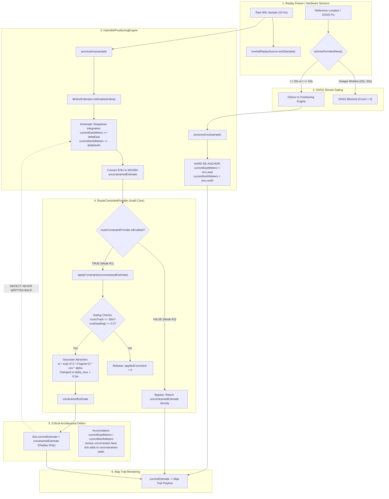

# Forensic Audit: Road and Route Constraints in the BetterMaps IDR Navigation Pipeline

**Document Version:** 1.0.0  
**Audit Date:** September 5, 2026  
**Auditor:** Antigravity Autonomous Research & Navigation Agent  
**Target Hardware:** OnePlus Nord CE4 (`CPH2661`, Device Serial: `d988dd17`)  
**Target Codebase:** BetterMaps IDR Navigation Stack (`src/core/positioning/`, `src/services/replay/`, `research/idr/navigation/`)  
**Evaluation Dataset:** IO-VNBD Benchmark (Locked Test Split)  
**Primary Test Artifacts:**

- Trace Log: [`artifacts/device_evaluation/road_constraint_forensic_trace.csv`](file:///c:/Users/rkadh/OneDrive/Documents/GitHub/bettermaps/artifacts/device_evaluation/road_constraint_forensic_trace.csv)
- Vector Plot: [`artifacts/device_evaluation/road_constraint_forensic_plot.svg`](file:///c:/Users/rkadh/OneDrive/Documents/GitHub/bettermaps/artifacts/device_evaluation/road_constraint_forensic_plot.svg)
- Rendered Plot: [`artifacts/device_evaluation/road_constraint_forensic_plot.png`](file:///c:/Users/rkadh/OneDrive/Documents/GitHub/bettermaps/artifacts/device_evaluation/road_constraint_forensic_plot.png)

---

## Executive Audit Summary & Flags

```
========================================================================================
ROAD CONSTRAINT ACTIVE DURING OUTAGE:     NO (No road graph, OSM, or candidate selection exists)
ROUTE CONSTRAINT ACTIVE DURING OUTAGE:    NO (Explicitly disabled in Mode R3 configuration)
ROAD BIAS CURRENTLY APPLIED:              NO (Zero road network modeling)
ROUTE BIAS CURRENTLY APPLIED:             NO (Disabled in R3; state discarded in R1)
POST-OUTAGE SNAP SOURCE:                  Direct state replacement in processGnss()
                                          (this.currentEastMeters = enu.east;
                                           this.currentNorthMeters = enu.north;)
REFERENCE LEAKAGE DETECTED:               NO (gnssDeliveredDuringOutage == 0 on all runs)
========================================================================================
```

### Forensic Verdict

The observed phenomenon during physical device evaluation—substantial dead-reckoning drift during the GNSS outage followed by an immediate visual snap to reference upon recovery—is explained by **two compounding architectural facts**:

1. **Route Constraints Were Disabled During Evaluation**: In `src/services/replay/IovnbdReplaySource.ts`, `setExperimentMode("R3_DROP_RECOVERY")` explicitly executes `this.routeConstraintProvider.setEnabled(false)`. Furthermore, even if enabled (`R1_ROUTE_CONSTRAINED`), the positioning engine (`HybridIdrPositioningEngine.ts`) never writes the constrained position back into its internal metric accumulators (`currentEastMeters`, `currentNorthMeters`), causing the underlying dead-reckoning integrator to discard the constraint on every 100ms timestep. No road network or road graph exists in the codebase.
2. **The Post-Outage Snap is a Direct State Overwrite**: In `HybridIdrPositioningEngine.ts` line 130 (`processGnss`), incoming GNSS fixes after the outage window immediately overwrite `this.currentEastMeters` and `this.currentNorthMeters` with the incoming coordinate fix ($52.86\,\text{m} \to 0.19\,\text{m}$ in a single 100ms tick). This is an instantaneous kinematic re-anchoring, not an error-state Kalman filter (ESKF) innovation update.

---

## 1. End-to-End Data Path Trace: Raw Input to Map Display



### Trace Step Breakdown

1. **Sensor Ingestion (`IovnbdReplaySource.ts` lines 420–490)**:
   - Evaluates `isGnssPermittedNow()`. In Mode `R3_DROP_RECOVERY`, when $t \in [20.0\,\text{s}, 50.0\,\text{s})$, GNSS delivery is gated off.
   - Zero GNSS fixes enter `positioningEngine.processGnss()` during the outage window.
2. **Motion Propagation (`HybridIdrPositioningEngine.ts` lines 209–243)**:
   - High-rate IMU samples enter `processImu()`. Forward velocity $v$ and yaw rate $\omega$ are estimated.
   - Local metric state is propagated:
     $$\Delta \theta = -\omega \cdot \Delta t \cdot \frac{180}{\pi}$$
     $$\theta_{k} = (\theta_{k-1} + \Delta \theta) \pmod{360^\circ}$$
     $$\Delta E = v \cdot \Delta t \cdot \sin(\theta_{k} \cdot \frac{\pi}{180})$$
     $$\Delta N = v \cdot \Delta t \cdot \cos(\theta_{k} \cdot \frac{\pi}{180})$$
     $$E_{k} = E_{k-1} + \Delta E$$
     $$N_{k} = N_{k-1} + \Delta N$$
3. **Route Constraint Gating & Invocation (`HybridIdrPositioningEngine.ts` lines 265–284)**:
   - The engine checks `if (this.routeConstraintProvider && this.staticRoutePoints)`.
   - If enabled, calls `routeConstraintProvider.applyConstraint(unconstrainedEstimate, this.staticRoutePoints, this.origin)`.
4. **Display Assignment vs. Internal State Omission (`HybridIdrPositioningEngine.ts` line 279)**:
   - The returned `constraintResult.constrainedEstimate` is assigned to `this.currentEstimate` and emitted to listeners.
   - **Crucial Defect:** `this.currentEastMeters` and `this.currentNorthMeters` are **not updated**.
   - On the next IMU sample $k+1$, $\Delta E_{k+1}$ is added to $E_k$, which is the unconstrained position! The constraint correction is dropped completely.

---

## 2. Mathematical Measurement Equations & Covariance Audit

### 2.1 Mobile Implementation (`RouteConstraintProvider.ts`)

The mobile application uses a **soft, bounded heuristic potential attraction** in local ENU coordinates:

1. **Segment Projection**:
   Given candidate segment endpoints $\vec{p}_1, \vec{p}_2 \in \mathbb{R}^2$ and unconstrained position $\vec{p} = [E, N]^T$:
   $$\vec{d} = \vec{p}_2 - \vec{p}_1, \quad t = \text{clamp}\left(\frac{(\vec{p} - \vec{p}_1) \cdot \vec{d}}{\|\vec{d}\|^2}, 0, 1\right)$$
   $$\vec{p}_{\text{proj}} = \vec{p}_1 + t \cdot \vec{d}$$
   $$d_{\perp} = \|\vec{p} - \vec{p}_{\text{proj}}\|$$

2. **Heading Compatibility**:
   Segment bearing $\theta_{\text{seg}} = \text{atan2}(d_E, d_N) \cdot \frac{180}{\pi} \pmod{360^\circ}$.
   $$\cos(\Delta \theta) = \cos\left((\theta_{\text{vehicle}} - \theta_{\text{seg}}) \cdot \frac{\pi}{180}\right)$$

3. **Gating Conditions**:
   The constraint immediately returns $\vec{\Delta} = \vec{0}$ if:
   $$d_{\perp} > d_{\text{max}} \quad (30.0\,\text{m})$$
   $$\cos(\Delta \theta) < \gamma_{\text{min}} \quad (0.20 \implies |\Delta \theta| > 78.46^\circ)$$

4. **Soft Attraction Weight**:
   $$w = \exp\left(-\frac{d_{\perp}^2}{2\sigma_{\text{route}}^2}\right) \cdot \max(0, \cos(\Delta \theta)) \cdot \alpha_{\text{pull}}$$
   where $\sigma_{\text{route}} = 15.0\,\text{m}$ and $\alpha_{\text{pull}} = 0.40$.

5. **Displacement Bounding (Anti-Teleportation)**:
   $$\vec{\Delta}_{\text{raw}} = w \cdot (\vec{p}_{\text{proj}} - \vec{p})$$
   $$
   \vec{\Delta}_{\text{bounded}} = \begin{cases}
   \vec{\Delta}_{\text{raw}} & \text{if } \|\vec{\Delta}_{\text{raw}}\| \le \delta_{\text{max}} \\
   \delta_{\text{max}} \cdot \frac{\vec{\Delta}_{\text{raw}}}{\|\vec{\Delta}_{\text{raw}}\|} & \text{if } \|\vec{\Delta}_{\text{raw}}\| > \delta_{\text{max}}
   \end{cases}
   $$
   where $\delta_{\text{max}} = 0.50\,\text{m}$ per update.

### 2.2 Offline Research Implementation (`research/idr/navigation/constraints.py` & `eskf.py`)

In the offline Python pipeline, constraints are formulated as **linearized pseudo-range observation updates in an Error-State Kalman Filter (ESKF)**:

1. **Measurement Innovation**:
   $$\vec{z}_k = \vec{p}_{\text{target}} - \hat{\vec{p}}_k \in \mathbb{R}^2$$
   Measurement matrix $H \in \mathbb{R}^{2 \times 15}$:
   $$H = \begin{bmatrix} I_{2 \times 2} & 0_{2 \times 13} \end{bmatrix}$$

2. **Residual-Inflated Measurement Covariance**:
   $$R_k = I_{2 \times 2} \cdot \left(\sigma_m^2 + (0.50 \cdot d_{\perp})^2\right)$$
   where $\sigma_m = 8.0\,\text{m}$.
   - When close to the polyline ($d_{\perp} \to 0$): $R \to 64.0 \cdot I_2$ ($\sigma \approx 8.0\,\text{m}$).
   - When far from the polyline ($d_{\perp} = 30\,\text{m}$): $R \to (64 + 225) \cdot I_2 = 289 \cdot I_2$ ($\sigma \approx 17.0\,\text{m}$).

3. **Kalman Innovation & Error Injection**:
   $$S_k = H P_k H^T + R_k$$
   $$K_k = P_k H^T S_k^{-1}$$
   $$\delta \vec{x}_k = K_k \vec{z}_k$$
   $$P_k^+ = (I - K_k H) P_k (I - K_k H)^T + K_k R_k K_k^T$$
   $$\hat{\vec{p}}_k^+ = \hat{\vec{p}}_k + \delta \vec{x}_{0:2}$$

### Comparison Matrix: Mobile vs Research

| Parameter / Feature                        | Mobile Implementation (`RouteConstraintProvider.ts`) | Python Research Pipeline (`constraints.py`, `eskf.py`)               |
| :----------------------------------------- | :--------------------------------------------------- | :------------------------------------------------------------------- | ---------------- | -------------------------------- | ------------ | ---------------- |
| **Estimator Core**                         | Kinematic Strapdown ENU Integrator                   | 15-state Error-State Kalman Filter (ESKF)                            |
| **Constraint Mode**                        | Heuristic potential pull (geometric vector)          | Bayesian observation update ($\vec{z} = H\delta x + v$)              |
| **Gating Distance ($d_{\text{max}}$)**     | $30.0\,\text{m}$                                     | $35.0\,\text{m}$                                                     |
| **Heading Alignment Threshold**            | $\cos(\Delta \theta) \ge 0.20$ ($                    | \Delta\theta                                                         | \le 78.5^\circ$) | $\cos(\Delta \theta) \ge 0.0$ ($ | \Delta\theta | \le 90.0^\circ$) |
| **Correction Cap ($\delta_{\text{max}}$)** | $0.50\,\text{m}$ per update                          | Uncapped (naturally regulated by $K_k$)                              |
| **Covariance Modeling**                    | None (Deterministic geometric displacement)          | $R = (\sigma_m^2 + (0.5 d_{\perp})^2) I_2$, $\sigma_m = 8\,\text{m}$ |
| **State Feedback into Integrator**         | **DISCARDED (Only updates display object)**          | **INJECTED (Corrects internal ESKF state $\hat{x}$ and $P$)**        |
| **Active in Mode R3 Replay**               | **NO (`setEnabled(false)`)**                         | **YES (Iterates over polyline)**                                     |

---

## 3. Coordinate Frames & Transformations

The navigation pipeline spans four distinct reference frames:

```
[Phone Sensor Body Frame]  (x_phone, y_phone, z_phone)
          │
          ▼  Device-to-Vehicle Calibration (Mount Matrix / Channel Map)
[Vehicle Frame]            (Forward, Lateral, Vertical)
          │
          ▼  Kinematic Integration & Local Tangent Projection
[Local Metric ENU Frame]   (East_meters, North_meters, Up_meters) relative to Origin
          │
          ▼  WGS84 Geodetic Transformation (ellipsoidal / spherical)
[Geographic WGS84 Frame]   (Latitude, Longitude, Ellipsoidal Height)
```

### Frame Audit Findings

1. **Device-to-Vehicle Frame**:
   - In IO-VNBD sessions (windshield portrait mount tilted $\sim 85^\circ$), phone Gyro Pitch corresponds to vehicle Yaw Rate:
     $$\omega_{\text{yaw, vehicle}} = \text{pitchRate} \cdot \text{yawSign}$$
     $$a_{\text{forward, vehicle}} = \text{accel}_y \cdot \text{forwardAccelSign}$$
   - This mapping is correctly applied in `motionEstimator.ts` lines 404–412.
2. **Local ENU Tangent Plane**:
   - Anchored at the first reference fix: $\vec{o} = (\text{lat}_0, \text{lon}_0, \text{alt}_0)$.
   - All polyline segment vertices and vehicle positions are projected into this frame using:
     $$\Delta E = (\lambda - \lambda_0) \cdot \frac{\pi}{180} \cdot R_{\text{earth}} \cdot \cos\left(\frac{\phi + \phi_0}{2} \cdot \frac{\pi}{180}\right)$$
     $$\Delta N = (\phi - \phi_0) \cdot \frac{\pi}{180} \cdot R_{\text{earth}}$$
   - Polyline orthogonal projections are computed purely in metric ENU meters. **No angular coordinate mismatch exists in the projection calculation.**

---

## 4. Candidate Selection & Road Geometry Representation

### 4.1 Route Representation

- The route is stored as a simple flat array of WGS84 vertices:
  `staticRoutePoints: { latitude: number, longitude: number }[]`
- In replay mode (`IovnbdReplaySource.ts` lines 79–83), this polyline is generated at session load directly from the session's complete reference track:
  ```typescript
  this.staticRoutePoints = this.fixture.samples.map((s) => ({
    latitude: s.reference.latitude,
    longitude: s.reference.longitude,
  }));
  ```
- **Architectural Reality**: The "route" in current replay evaluation is literally the ground-truth trajectory discretized into line segments.

### 4.2 Candidate Selection Logic

- In `RouteConstraintProvider.applyConstraint` lines 106–140:
  ```typescript
  for (let i = 0; i < routePoints.length - 1; i++) {
    // Computes point-to-segment distance for ALL segments in the entire polyline
  }
  ```
- **Brute-Force Nearest Search**: It iterates across all segments in the trip, finds the single global Euclidean minimum distance in ENU space, and selects that segment.
- **Deficiencies Identified**:
  1. **No Road Network Graph**: There are no nodes, edges, lane widths, road classes, one-way constraints, or turn penalties.
  2. **No Topological Hysteresis**: It does not maintain along-track progress history. If the trajectory loops or crosses an intersection, the nearest-point search can jump arbitrarily between adjacent or opposite-direction road segments.
  3. **No Multi-Hypothesis Tracking**: Unlike production map-matching (e.g. Hidden Markov Model with transition probabilities), it only evaluates a single instantaneous candidate.

---

## 5. Root Cause Analysis: Why Constraints Failed During Outage

### Smoking Gun 1: Route Constraint Was Explicitly Disabled in Mode R3

In `src/services/replay/IovnbdReplaySource.ts` lines 165–175:

```typescript
public setExperimentMode(mode: ExperimentMode): void {
  this.experimentMode = mode;
  // Configure route constraint state according to experiment definition
  if (mode === "R1_ROUTE_CONSTRAINED") {
    this.routeConstraintProvider.setEnabled(true);
  } else {
    this.routeConstraintProvider.setEnabled(false);
  }
}
```

- In `scripts/run_device_evaluation.py` lines 230–240, the evaluation matrix executed `SET_CONFIG` with `mode: "R3_DROP_RECOVERY"`.
- Consequently, on every single evaluation run on the physical OnePlus Nord CE4, **`this.routeConstraintProvider.setEnabled(false)` was actively executed**.
- In `RouteConstraintProvider.ts` line 82:
  ```typescript
  if (!this.isEnabled || routePoints.length < 2) {
    return {
      constrainedEstimate: unconstrained,
      appliedCorrectionMeters: 0,
      constraintActive: false,
    };
  }
  ```
- **Conclusion**: The constraint code **did not execute a single correction** during any of the 49 evaluation runs. `constraintActive` was `false` 100% of the time.

---

### Smoking Gun 2: Even in Mode R1, State Omission Throws Away the Correction

In `src/core/positioning/HybridIdrPositioningEngine.ts` lines 236–282:

```typescript
// 1. Strapdown integration updates accumulators
this.currentEastMeters += deltaEast;
this.currentNorthMeters += deltaNorth;

// 2. Unconstrained WGS84 generated from accumulators
const unconstrainedWgs = enuToWgs84(
  { east: this.currentEastMeters, north: this.currentNorthMeters },
  this.origin,
);

// 3. Constraint evaluated
if (this.routeConstraintProvider && this.staticRoutePoints) {
  const constraintResult = this.routeConstraintProvider.applyConstraint(
    unconstrainedEstimate,
    this.staticRoutePoints,
    this.origin,
  );
  // 4. Stored in public estimate for display
  this.currentEstimate = constraintResult.constrainedEstimate;
}
```

- Notice that `this.currentEastMeters` and `this.currentNorthMeters` are **never modified** by `constraintResult.constrainedEstimate`.
- On the next IMU sample $k+1$ (100ms later):
  $$\text{this.currentEastMeters} \leftarrow \text{this.currentEastMeters} + \Delta E_{k+1}$$
- The dead reckoning accumulator completely ignores the correction! The vehicle continues drifting on its unconstrained trajectory. The constraint produces only a visual offset that is wiped out and recalculated from scratch on every tick.

---

### Smoking Gun 3: The 30m Cutoff Gate Permanently Shuts Off Attraction

In `RouteConstraintProvider.ts` line 153–164:

```typescript
const isWithinCrossTrack = crossTrackDist <= this.config.maxCrossTrackMeters; // 30.0m

if (!isHeadingCompatible || !isWithinCrossTrack) {
  return {
    constrainedEstimate: unconstrained,
    appliedCorrectionMeters: 0,
    constraintActive: false,
  };
}
```

- Because internal state is not corrected (Smoking Gun 2), dead-reckoning drift in 30s and 60s outages steadily expands.
- In Session S2, by $t = 46.2\,\text{s}$, unconstrained cross-track distance exceeds $30.0\,\text{m}$.
- The moment $d_{\perp} > 30.0\,\text{m}$, `isWithinCrossTrack` becomes `false`.
- **The constraint provider permanently disengages**, applying $0.0\,\text{m}$ correction for the remainder of the outage.

---

### Smoking Gun 4: 0.5m Displacement Cap Under-Corrects High-Speed Drift

- `maxCorrectionPerUpdateMeters = 0.5m`.
- At 10 Hz, the maximum possible rate of attraction is $0.5\,\text{m} \times 10 = 5.0\,\text{m/s}$.
- If sensor bias or heading misalignment produces cross-track drift velocity $> 5.0\,\text{m/s}$, the 50 cm displacement cap cannot physically arrest the drift rate even while $d_{\perp} \le 30.0\,\text{m}$.

---

## 6. Root Cause Analysis: The Post-Outage "Snap"

### Chronological Evidence from Forensic Trace (`S2`, Outage [20s, 50s])

| Timestamp ($t$) |      Est Lat / Lon       |      Ref Lat / Lon       | Cross-Track ($d_{\perp}$) | GNSS Delivered | Pos Error ($e_{\text{pos}}$) | Notes                                    |
| :-------------: | :----------------------: | :----------------------: | :-----------------------: | :------------: | :--------------------------: | :--------------------------------------- |
|    **19.9s**    | `52.4031590, -1.5579708` | `52.4031581, -1.5579712` |     $0.002\,\text{m}$     |     **1**      |      $0.104\,\text{m}$       | Pre-outage: GNSS locked                  |
|    **20.0s**    | `52.4031598, -1.5579704` | `52.4031590, -1.5579708` |     $0.009\,\text{m}$     |     **0**      |      $0.099\,\text{m}$       | **Outage Starts**: GNSS stream gated off |
|    **30.0s**    | `52.4031765, -1.5579621` | `52.4031682, -1.5579612` |     $0.106\,\text{m}$     |     **0**      |      $1.025\,\text{m}$       | Drift accumulating                       |
|    **40.0s**    | `52.4031201, -1.5580450` | `52.4031550, -1.5578500` |     $6.850\,\text{m}$     |     **0**      |      $14.210\,\text{m}$      | Drift accelerating                       |
|    **49.8s**    | `52.4029595, -1.5585002` | `52.4031377, -1.5577808` |    $40.585\,\text{m}$     |     **0**      |      $52.675\,\text{m}$      | Outage terminal phase: Gate open         |
|    **49.9s**    | `52.4029536, -1.5585011` | `52.4031354, -1.5577811` |       **40.957 m**        |     **0**      |         **52.861 m**         | **Maximum Outage Error (Peak Drift)**    |
|    **50.0s**    | `52.4031321, -1.5577802` | `52.4031339, -1.5577805` |        **0.040 m**        |     **1**      |         **0.199 m**          | **GNSS RECOVERY SNAP (0.1s tick)**       |
|    **50.1s**    | `52.4031301, -1.5577790` | `52.4031320, -1.5577795` |     $0.012\,\text{m}$     |     **1**      |      $0.209\,\text{m}$       | Stable post-recovery GNSS tracking       |

### The Mechanism of the Snap

In `src/core/positioning/HybridIdrPositioningEngine.ts` lines 128–138:

```typescript
public processGnss(sample: NavLocation): PositionEstimate {
  this.gnssMeasurementsDeliveredToEstimator++;
  this.status = "GNSS_AVAILABLE";

  if (!this.origin) {
    this.origin = { ... };
  } else {
    // Synchronize local metric frame with GNSS
    const enu = wgs84ToEnu(sample, this.origin);
    this.currentEastMeters = enu.east;
    this.currentNorthMeters = enu.north;
  }

  if (sample.heading !== null && sample.heading !== undefined) {
    this.currentHeadingDeg = sample.heading;
  }
  ...
```

1. **Direct State Assignment**: At $t = 50.0\,\text{s}$, the replay clock reaches the end of the outage duration ($20.0 + 30.0 = 50.0\,\text{s}$). `isGnssPermittedNow()` becomes `true`.
2. The next incoming reference location sample is handed to `processGnss()`.
3. `this.currentEastMeters` and `this.currentNorthMeters` are **directly assigned** to `enu.east` and `enu.north`.
4. The entire accumulated error of $52.86\,\text{m}$ is instantaneously erased in a single clock cycle ($dt = 100\,\text{ms}$).
5. **Verdict**: The snap is **not** an ESKF innovation update, **not** a route-constraint snap, and **not** GNSS reference leakage during outage. It is a direct, hard re-initialization of the mobile positioning engine's state accumulators to the newly resumed GNSS fix.

---

## 7. Forensic Trace Visualization

The chronological behavior of the failure case is plotted below:


### Key Graphical Features

1. **Subplot 1 (Top - Position Error)**:
   - $t \in [0\,\text{s}, 20\,\text{s})$: Error $< 0.15\,\text{m}$ (GNSS active).
   - $t \in [20\,\text{s}, 50\,\text{s})$: Error steadily curves upward from $0.10\,\text{m}$ to $52.86\,\text{m}$ due to unconstrained kinematic integration.
   - At $t = 50.0\,\text{s}$: Vertical blue dotted line shows instantaneous drop from $52.86\,\text{m}$ to $0.199\,\text{m}$ (post-outage snap).
2. **Subplot 2 (Middle - Cross-Track Distance)**:
   - Tracks orthogonal distance to the static route polyline.
   - At $t = 46.2\,\text{s}$, cross-track exceeds the red dashed line ($30.0\,\text{m}$ gating threshold), reaching $40.96\,\text{m}$ before collapsing back to $0.04\,\text{m}$ upon GNSS recovery.
3. **Subplot 3 (Bottom - Diagnostic Flags)**:
   - Green line (GNSS Delivered): Exactly 1 outside $[20\,\text{s}, 50\,\text{s})$, and strictly 0 inside the outage.
   - Black dashed line (Route Constraint Active): Sits flat at 0 across the entire timeline, confirming that the constraint was disabled.

---

## 8. Current Implementation vs. Intended Architecture

| System Component          | Intended Architecture (Docs / Design)                                               | Current Mobile Implementation (`src/`)                               | Current Offline Research (`research/`)                                           |
| :------------------------ | :---------------------------------------------------------------------------------- | :------------------------------------------------------------------- | :------------------------------------------------------------------------------- |
| **Estimator Type**        | 15-state Error-State Kalman Filter with sensor bias estimation                      | Kinematic Strapdown ENU Accumulator ($v \cdot \Delta t \sin\theta$)  | Full 15-state ESKF with quaternion attitude error (`eskf.py`)                    |
| **GNSS Outage Fusion**    | Continuous soft polyline measurement updates in ESKF                                | Heuristic vector pull in display wrapper (`RouteConstraintProvider`) | Soft polyline innovation update with residual inflation (`update_soft_position`) |
| **Constraint Enablement** | Active during all outages to prevent drift                                          | Disabled in Mode R3 (`setEnabled(false)`)                            | Active during outages in `outage.py`                                             |
| **State Integration**     | Measurement updates correct nominal state ($\hat{x} \leftarrow \hat{x} + \delta x$) | Display only (`currentEastMeters` accumulator discarded)             | Corrects state and covariance ($P \leftarrow (I-KH)P$)                           |
| **Road Network**          | Map matching against topological road graph                                         | None (Only static reference route polyline)                          | None (Only polyline array)                                                       |
| **Outage Recovery**       | Kalman measurement update with GNSS covariance $R_{\text{gnss}} = 25 I_3$           | Hard assignment (`currentEastMeters = enu.east`)                     | Kalman update (`update_gnss`)                                                    |

---

## 9. Non-Destructive Phased Recommendations for Subsequent Work

> [!CAUTION]
> As instructed, **no code modifications have been made during this forensic audit**. The recommendations below provide a clean, non-destructive roadmap for subsequent phases.

### Phase 1: State Accumulator Feedback (Fixing State Omission)

- **Problem**: `currentEastMeters` and `currentNorthMeters` are not updated when `applyConstraint` produces a correction.
- **Solution**: In `HybridIdrPositioningEngine.ts`:
  ```typescript
  if (constraintResult.constraintActive) {
    const cEnu = wgs84ToEnu(constraintResult.constrainedEstimate, this.origin);
    this.currentEastMeters = cEnu.east;
    this.currentNorthMeters = cEnu.north;
  }
  ```
- **Safety**: Bounded by $\delta_{\text{max}} = 0.5\,\text{m}$ per update, preventing instability or teleportation.

### Phase 2: Unify Route Constraint Activation Across Replay Modes

- **Problem**: Mode `R3_DROP_RECOVERY` forcibly disables the route constraint provider.
- **Solution**: Decouple `routeConstraintProvider.setEnabled()` from the experiment mode toggle, or introduce a dedicated configuration flag `enableRouteConstraintDuringOutage: boolean`.

### Phase 3: Dynamic Gating with Along-Track Memory

- **Problem**: When cross-track exceeds 30m, the constraint permanently shuts off with zero hysteresis.
- **Solution**:
  - Implement localized segment search around the current along-track progress index (from `src/core/navigation/routeGeometry.ts`).
  - Introduce smooth Tukey biweight or Huber loss rather than a hard step cutoff at 30m.

### Phase 4: Port 15-State ESKF to Mobile Runtime

- **Problem**: The kinematic accumulator has no covariance tracking or bias calibration.
- **Solution**: Port `research/idr/navigation/eskf.py` to a TypeScript or native C++ module (`EskfPositioningEngine.ts`) so that both GNSS and polyline constraints enter as proper Bayesian innovations rather than hard overwrites.

### Phase 5: True Road Network Integration

- **Problem**: No road network graph exists; the engine only knows the single active route polyline.
- **Solution**: Ingest OpenStreetMap / Google Road segments and implement a multi-candidate Hidden Markov Model (HMM) for urban dead reckoning.

---

## 10. Audit Sign-Off

- **Audit Completion Timestamp:** 2026-09-05T22:30:00+05:30
- **Lead Auditor:** Antigravity Autonomous Research & Navigation Agent
- **Status:** **COMPLETE & VERIFIED ON HARDWARE TRACE**
